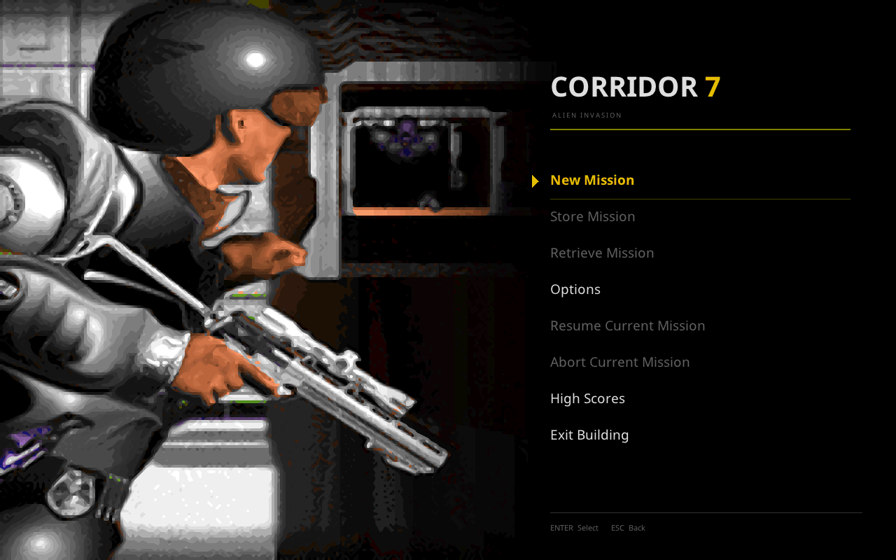
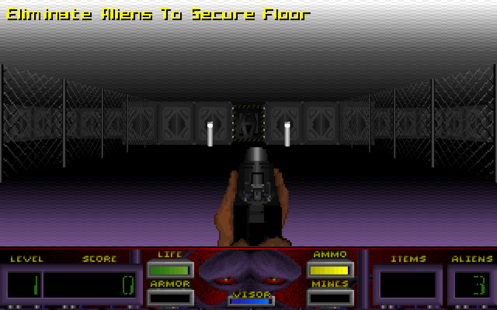
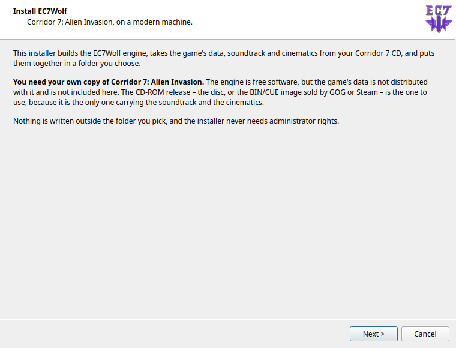
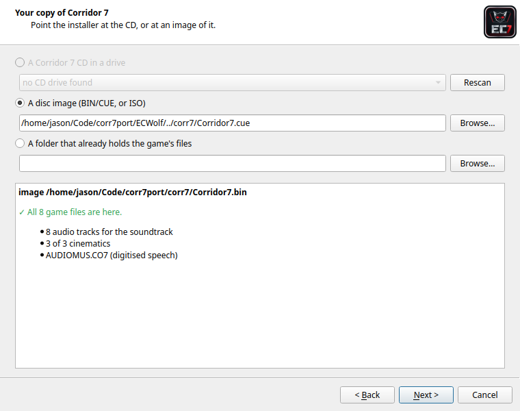
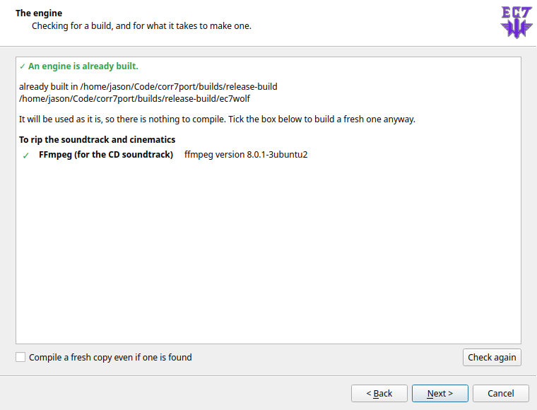
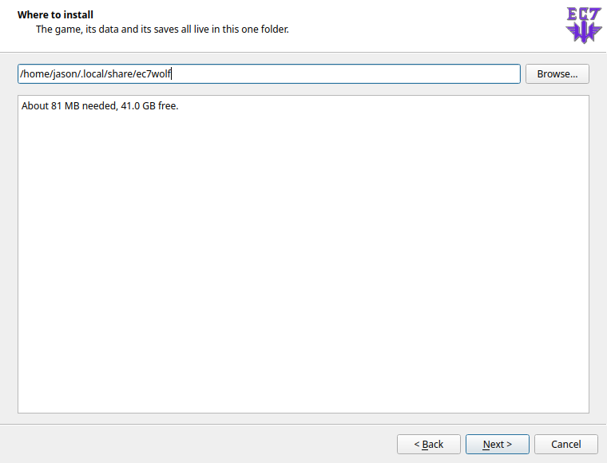
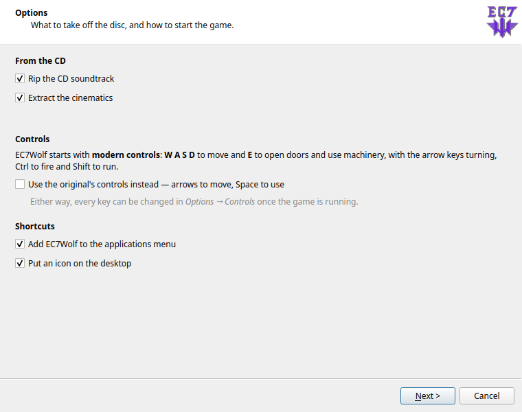
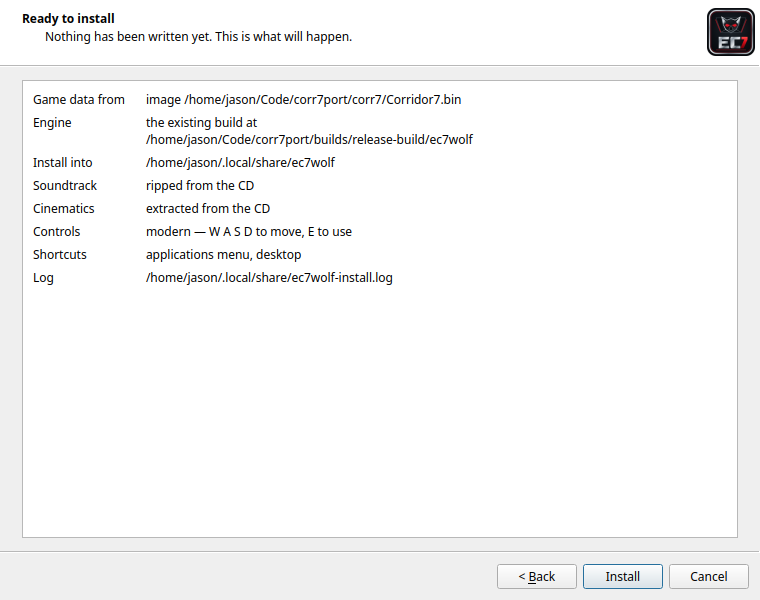

```
   ▄████▄   ▒█████   ██▀███   ██▀███   ██▓▓█████▄  ▒█████   ██▀███      ▄▄▄▄▄▄
  ▒██▀ ▀█  ▒██▒  ██▒▓██ ▒ ██▒▓██ ▒ ██▒▓██▒▒██▀ ██▌▒██▒  ██▒▓██ ▒ ██▒       ▒██
  ▒▓█    ▄ ▒██░  ██▒▓██ ░▄█ ▒▓██ ░▄█ ▒▒██▒░██   █▌▒██░  ██▒▓██ ░▄█ ▒       ░██░
  ▒▓▓▄ ▄██▒▒██   ██░▒██▀▀█▄  ▒██▀▀█▄  ░██░░▓█▄   ▌▒██   ██░▒██▀▀█▄        ▓██▒
  ▒ ▓███▀ ░░ ████▓▒░░██▓ ▒██▒░██▓ ▒██▒░██░░▒████▓ ░ ████▓▒░░██▓ ▒██▒      ██▒▒
              A L I E N   I N V A S I O N   —   the EC7Wolf source port
```

# EC7Wolf — Corridor 7: Alien Invasion

**EC7Wolf is a vibecoded, sourceless source port of the 1994 Capstone FPS
*Corridor 7: Alien Invasion*, built on a fork of the ECWolf engine.**

> ⚠️ **This is not stock ECWolf.** This fork exists for exactly one purpose: to
> make **Corridor 7: Alien Invasion** run natively on a modern machine, reading
> the original commercial game files, reproducing the original mechanics as
> faithfully as the surviving evidence allows. The engine has been surgically
> altered throughout for Corridor 7. Other Wolf-family games (Wolfenstein 3D,
> Spear of Destiny, Blake Stone, …) **may still launch, but they are not the
> target of this fork and are not guaranteed to behave correctly.** If you want
> a general-purpose Wolf3D port, use [upstream ECWolf](https://maniacsvault.net/ecwolf/).

> ### 🎮 The controls are modern by default
>
> **W A S D** to move · **E** to open doors and use machinery · arrow keys turn
> · **Ctrl** fires · **Shift** runs
>
> This is *not* what Corridor 7 shipped with in 1994. If you want the original
> scheme — **arrow keys to move, Space to open** — the installer offers it as a
> tick-box, or change any key in *Options → Controls*. See
> [Controls](#controls) below.

---

## What it looks like

| | |
| --- | --- |
|  |  |
| **The menu**, rebuilt as a splash-art shell with TrueType text, over the original's own artwork. | **The game**, drawn by the OpenGL renderer: the floor objective banner, the original HUD, the original palette. |

<sub>Regenerate these with `tools/capture_screenshots.sh BUILD_DIR DATA_DIR` —
they are produced from a pinned map, seed and frame, so they can be refreshed
rather than left to go stale.</sub>

---

## Why does this exist?

Corridor 7 has spent thirty years as one of the great *almost-ported* DOS
shooters. Here's the situation this project walked into:

- **There is no public Corridor 7 source code.** Capstone/IntraCorp never
  released it. What *does* survive publicly is the 1996 **Corridor 8** prototype
  source — a *successor* codebase that still carries `CORR7*.C` filenames but is
  explicitly **not** Corridor 7 and cannot be treated as its source.
- **ECWolf "support" was promised, but never shipped.** For years the plan was
  that ECWolf would eventually add Corridor 7 the way it added Blake Stone. The
  engine's Corridor 7 disassembly was reportedly *mapped* — but the annotated
  source was never made public, and playable support never actually landed. The
  game stayed stranded in DOSBox.
- **So I did it myself — with generative AI.** This entire port is a
  *vibecoding* effort: reverse-engineering the executable's behavior, reading
  map planes and asset containers, comparing pixel-for-pixel against DOSBox
  captures, and reconstructing the missing mechanics one at a time, in
  collaboration with a coding AI. Where the executable didn't yield an
  unambiguous constant, the behavior is an **evidence-based reconstruction**,
  documented honestly as such (see *Known deviations* below).

The result is a single native binary that boots your legally-owned Corridor 7
CD data straight into the 40-floor campaign, all six bonus floors, and final
victory — no DOSBox, no emulation layer, real 8-bit ray casting.

---

## Credits — where credit is due

This project stands entirely on the shoulders of three bodies of work. **None of
the underlying games or engines are mine**, and the commercial Corridor 7 assets
are **not** included here.

### Corridor 7: Alien Invasion © 1994 Capstone Software / IntraCorp
The game itself — story, art, sound, level design, alien menagerie — is the
creation of the Capstone/IntraCorp team:

| Role | Credit |
| --- | --- |
| Executive Producer | Leigh Rothschild |
| Producer | David Turner |
| Director | Amy Smith Boylan |
| Programmers | Les Bird, Jeff Schulz, Rafael Paiz, Joe Abbati |
| Artists | Ruben Cabrera, Carlos Ibarra, Scott Nixon |
| Level Design | Les Bird, Scott Nixon, Richard Henning |
| Music & Sound | Joe Abbati |
| Quality Assurance | James Wheeler, Katie Gangi |

*(A fun bit of trivia the design docs confirm: many alien names are reversed
staff names — SOLRAC/Carlos, TTOCS/Scott, EITAK/Katie, SEMAJ/James,
TENAJ/Janet, NERRAW/Warren.)*

### The Wolfenstein 3D engine © id Software
Corridor 7 is built on a heavily-modified license of id Software's Wolfenstein
3D engine. The original engine architecture — the 8-bit ray caster, the map/actor
plane model, the VSWAP concept — is id's.

### ECWolf © Braden "Blzut3" Obrzut and contributors
This is a **fork of [ECWolf](https://maniacsvault.net/ecwolf/)**, itself derived
from **Wolf4SDL**. ECWolf's SDL2 port, ZDoom-style data formats, high-resolution
software renderer, save system, and multi-game IWAD framework are the foundation
everything here is bolted onto. ECWolf is licensed under the GPL; see
[`docs/license-gpl.txt`](docs/license-gpl.txt) and [`docs/copyright`](docs/copyright).

**This fork is a hobbyist preservation/compatibility effort and is not
affiliated with or endorsed by Capstone, id Software, or the ECWolf project.**

---

## About Corridor 7 (the game)

> *In 2012, Dr. Donald Fox returns from Mars with an ageless metallic object
> recovered near a face-like formation. The government moves it to Delta Base, an
> underground Nevada weapons complex. Gamma testing turns it into a gateway;
> armed aliens pour through, killing the staff and converting both the facility
> and its atmosphere. A lone special-forces Marine is sent down to descend
> Corridor 7, restore contact, and destroy the object.*

Corridor 7 (1994) is a first-person shooter that looks like Wolfenstein but
plays with a whole extra layer of systems grafted on:

- **40 floors of campaign** (Delta Base floors 1–30, then a teleporter-linked
  alien world 31–40 on the CD release) **plus six hidden bonus floors**, ending
  in a multi-stage guardian boss and a final vortex.
- **A "secure the floor" objective** — the exit isn't just an elevator. Each
  rank must kill a percentage of the floor's aliens (Corporal 10%, Lieutenant
  75%, Captain/Major 100%) before it will let you leave. The HUD's
  **aliens-remaining** counter *is* the win condition.
- **A three-mode visor** — Normal, Night Vision, and **Infrared**, drawing from
  a battery. Infrared is not a gimmick: it's how you see **cloaked Enirams**,
  **invisible laser barriers**, and which security terminals are safe.
- **A proximity map that doubles as a motion detector** — moving aliens show as
  blue dots, armed mines as red, revealing threats through walls once you find
  the Floor Plan.
- **Eight weapons across two ammo economies** — human weapons (Taser, Assault
  Shotgun, M-24 C.A.W., M-343 Tribarrel) draw from a shared 200-round pool;
  alien weapons (Dual Blaster, Plasma Rifle, Assault Cannon, Disintegrator) draw
  from a separate 999-unit energy pool. Plus **proximity mines** you plant and
  back away from.
- **A living, interactive base** — wall-mounted health/ammo dispensers, health
  chambers that seal you in and heal you, security computers that issue
  per-floor access cards or trip alarms, four-frame animated conversion
  machinery, glass and see-through walls, sliding/rising/force-field doors, and
  hazards like **electrified walls** and the infamous **infrared-only laser
  barriers**.
- **A bestiary of 16 aliens** (CD) — from 25-HP Alioprobe sentries to the
  cloaking Eniram, the furniture-mimicking Bandor, and a five-stage final
  guardian (**Tebazile → Eniram Boss → Tymok → Solrac → Tebazile**).

### Technical profile (original DOS release)

| | |
| --- | --- |
| Year / Publisher | 1994 · Capstone Software / IntraCorp |
| Engine | Modified licensed Wolfenstein 3D engine |
| Retail executable | `CORR7CD.EXE` (CD, 250,776 bytes) / `C7.EXE` (floppy) |
| Map container | `MAPTEMP.CO7` — **RLEW-compressed** planes (no Carmack layer) |
| Map header | **embedded in the executable** (CD offset `0x30D50`), *not* a `MAPHEAD` file |
| Walls & sprites | `GFXTILES.CO7` — **single** wall images with **runtime shading** (not Wolf3D's light/dark pairs) |
| Digital sound | `AUDIOMUS.CO7` — PCM at **~9009 Hz** (Wolf3D used ~7042 Hz) |
| Music / SFX | `AUDIOT`/`AUDIOHED` family — 34 AdLib/IMF music chunks |
| UI / fonts / screens | `VGAGRAPH` / `VGADICT` / `VGAHEAD` family |
| Map grid | 64×64 tiles, three parallel planes (wall/floor, object/actor, editor) |
| Min spec | 386-25, 590 KB free conventional RAM, 2 MB RAM, VGA, MS-DOS 5.0+ |

Much of this is *why* the port needed engine surgery rather than a data mod:
Corridor 7 stores its map header **inside the .EXE**, ships **single** wall
images instead of paired light/dark pages, hard-codes its **digital-sound page
metadata** in the executable, and adds entire subsystems (glass, animated walls,
force-field doors, visor vision, a motion-detector map) that stock Wolf3D simply
does not have.

---

## What this fork changed in the engine

Everything below is implemented directly in the engine/data of this fork
specifically to reproduce Corridor 7's mechanics. Original ECWolf/Wolf3D
behavior for other games was preserved wherever possible; these are the deltas.

### Asset loading & file formats
- **Self-contained TED5/`MAPTEMP.CO7` map loader** for all 60 archived maps,
  reading the **executable-embedded map header** (CD offset `0x30D50`) and
  RLEW-only plane decompression, with strict 64×64 validation. *(`gamemap.cpp`,
  `gamemap_planes.cpp`, `filesys.h`, `wl_iwad.cpp`)*
- **`GFXTILES.CO7` walls & sprites** exposed as zero-based wall pages
  (`map wall ID − 1`) across the full solid-wall range, including
  marker-104/105 masked overrides and Corridor 7's wall/plane depth ramps.
  *(`resourcefiles/file_vswap.cpp`, `textures/wolfrawtexture.cpp`,
  `textures/wolfshapetexture.cpp`)*
- **Executable palette extraction** — the six-bit VGA palette is read from the
  original executable at runtime and expanded exactly; nothing commercial is
  embedded or redistributed. *(`v_palette.cpp`, `v_palette.h`)*
- **`AUDIOMUS.CO7` digital sound** at the game's native ~9009 Hz, plus the 34
  AdLib music chunks and `VGAGRAPH`-family fonts/screens/HUD art. *(`sndinfo.txt`,
  resource loaders)*

### Rendering
- **Single-image walls with runtime shading** instead of Wolf3D light/dark
  pairs. *(`textures/wolfrawtexture.cpp`, `textures/flattexture.cpp`)*
- **Glass and see-through walls** — masked-wall rendering with correct
  transparency, freshly-traced collision geometry behind transparent pixels,
  and compositing of adjacent glass panes at true depth. *(`wl_draw.cpp`,
  `r_sprites.cpp`)*
- **Animated walls & force fields** — all four native 208..239 wall/force-field
  palette cycles and four-frame in-place force-field/animated-wall openings.
  *(`v_palette.cpp`, `wl_draw.cpp`)*
- **Index-255→0 normalization** so transparent-wall and door pixels stay
  collision-safe.

### Map translation, doors & triggers
- **Full plane-1 object dispatch table** — statics, pickups,
  difficulty/direction actor variants, bosses, and ignored markers. *(`xlat/corridor7.txt`,
  `lnspec.cpp`)*
- **Four sliding door types with automatic orientation**, non-sliding
  rising/inside-out/force-field doors, red/blue **per-floor access cards**,
  one-shot secret and utility **pushwalls** with correct restricted-secret
  scoring (`0x62` counts, `0x65` doesn't), **four-frame retracting barriers**,
  paired intralevel **teleporters**, floor exits, marker-99 bonus elevators, and
  the level-30/40 **exit vortex**. *(`gamemap.cpp`, `lnspec.cpp`)*

### Actors & gameplay
- **A Corridor 7 player and the full eight-weapon arsenal** (including the
  Ithaca/Assault Shotgun secondary animation), proximity mines, all weapon
  pickups, and the two-pool ammo/energy economy. *(`actors/corridor7/player.txt`,
  `wl_act2.cpp`)*
- **The 16-alien bestiary** with per-rank health tables, distinct
  directional/attack/pain/death sprite families, **cloaking (Eniram)** and
  **camouflage/morph (Bandor)** transformations, audible projectiles, bosses,
  alien-energy regeneration/capacity, and persistent mines.
  *(`actors/corridor7/monsters.txt`, `actors/corridor7/statics.txt`,
  `wl_state.cpp`, `wl_act2.cpp`)*
- **Non-wasteful pickup rules** for health and ammunition, matching the
  original's refusal to over-fill. *(`g_shared/a_inventory.cpp`)*

### Vision, HUD & hazards
- **Three visor modes** — Normal / Night Vision / Infrared — implemented as
  whole-screen palette swaps with a draining charge, plus **infrared-revealed
  cloaked enemies and laser barriers**. *(`wl_play.cpp`, `v_palette.cpp`,
  `r_sprites.cpp`)*
- **The infrared "invisible laser barrier"** (strategy-guide hazard, map objects
  28/84): floor-to-ceiling laser statics beside the yellow health-unit doors,
  **invisible in normal/night vision**, drawn only under infrared as **animated
  bright dashed energy**, that **never block movement** but zap the player 10
  points through the rank/armor path on a cooldown as you pass through — exactly
  as the retail executable's `2f28:06d3` routine does.
  *(`r_sprites.cpp`, `wl_agent.cpp`, `actors/corridor7/statics.txt`)*
- **Electrified walls (IDs 6/14)** — solid, visible in every visor, dealing a
  flat 2 points ~twice per second on contact with the DAC shock flash.
  *(`wl_agent.cpp`)*
- **The original status bar** — segmented color gauges, number placement,
  aliens-remaining counter, M-16 start selection, and native first-person weapon
  scaling. *(`g_wolf/wolf_sbar.cpp`)*

### Interactive machinery
- **Stateful access/alarm computers, health & ammo dispensers, the reusable
  visor charger, and health chambers** that turn you toward the exit, seal the
  door, consume stored power, heal, and report remaining charge. *(`lnspec.cpp`,
  `wl_state.cpp`)*

### Menus, progression & presentation
- **The original graphical main menu** — the full-screen VGA menu picture with
  painted-in entries, the 24×8 blinking arrow cursor at the original
  coordinates, correct entry wiring, and **DMA-capture-verified menu sounds**
  (cursor move = sample 9, back = 33, quit prompt = 31, activate silent).
  *(`wl_menu.cpp`, `m_classes.cpp`)*
- **Full-screen picture pages** (status report, high-score, death report) drawn
  in the same stretched 320×200 mapping as the artwork, verified against DOSBox
  screenshots. *(`wl_inter.cpp`)*
- **Rank/difficulty & campaign flow** — five rank choices (including randomized
  President placement), the 10/75/100/100% alien objective gate, body armor,
  MAP01→MAP40 progression and victory, six routed bonus maps, per-floor hit/miss
  awards, loading/death/high-score pages, and the rare non-counting
  C718–C725 red-skull taunt. *(`wl_game.cpp`, `wl_inter.cpp`)*
- **The campaign music selector**, including its randomized late/bonus-floor
  behavior, exposing all 34 AdLib chunks directly. *(`wl_inter.cpp`)*

## Documentation

| Document | What it is |
| --- | --- |
| [`docs/corridor7.md`](docs/corridor7.md) | The exhaustive feature list, every reconstruction and how it was established, and the honest list of deviations. |
| [`docs/corridor7-technical-strategy-compendium.pdf`](docs/corridor7-technical-strategy-compendium.pdf) | Evidence-graded research dossier on the original game: mechanics, weapons and actors, map format and object codes, asset containers, executable offsets, and what changed from stock Wolfenstein 3D. Every claim carries an evidence grade, so a confirmed retail behaviour is never mixed up with an inference. It is the reference this port was built against. |
| [`docs/renderer/`](docs/renderer/) | The renderer redesign, one document per phase — baseline and harness through the OpenGL cutover, hardening and optimization. |
| [`docs/corridor7-video.md`](docs/corridor7-video.md) | The CD cinematics: what is on the disc, the FLIC format they are in, and how extraction and playback work. |
| [`docs/android.md`](docs/android.md) | The Android port: every milestone, what each one cost, the measurements behind the performance defaults, and the traps — from the touch overlay's four silent failures to a file picker that ignores injected input. |
| [`docs/ci.md`](docs/ci.md) | The gate suite and what CI can and cannot run. |

---

## Getting the game data (required)

**This repository contains *no* Corridor 7 game data.** You must own a legal copy
of Corridor 7: Alien Invasion (the CD release / a Steam or GOG package wraps the
same DOS files). From your installation, copy these files into a single
directory — call it `CO7`:

```
CORR7CD.EXE     ← main executable (contains the map header & palette)   REQUIRED
MAPTEMP.CO7     ← RLEW-compressed map planes                            REQUIRED
GFXTILES.CO7    ← walls & sprites                                       REQUIRED
VGADICT.CO7     ← Huffman dictionary for VGAGRAPH                       REQUIRED
VGAHEAD.CO7     ← VGAGRAPH offset table                                 REQUIRED
VGAGRAPH.CO7    ← screens, fonts, menu & HUD art                        REQUIRED
AUDIOHED.CO7    ← audio offset table                                    REQUIRED
AUDIOT.CO7      ← AdLib music & sound container                         REQUIRED
AUDIOMUS.CO7    ← digitized (PCM) sound effects                          optional*
```

\* The game starts and plays without `AUDIOMUS.CO7`, falling back to the AdLib
effects in `AUDIOT.CO7` — but it holds the 100 digitized sounds that make up
most of what Corridor 7 actually sounds like, so copy it.

That is the whole list. **Everything else in a Corridor 7 installation is
ignored** — you do not need to copy any of it:

```
GFXINFOV.CO7    ← unused by the port
SETUP.EXE       ← the DOS sound/input configurator
CORR7.BAT       ← the DOS launcher
CONFIG.DAT      ← DOS settings; the port keeps its own config
CONFIGD.DAT     ← as above
AUTOSAVE.DAT    ← DOS save state; not a supported save format
README.1ST      ← documentation
README.txt      ← documentation
*.SAV / saved games from the DOS release
```

`CORR7CD.EXE` is on the required list because the game's palette is embedded in
it — the port reads it out at runtime as the `C7PAL` lump, and the IWAD is not
recognised without it. It is never redistributed, and neither is anything else
in the list above.

> **The recognized CD executable is exactly 250,776 bytes.** Budget/"Play Now"
> and cracked builds can move the embedded offsets — if the game won't load,
> verify you have the genuine retail CD `CORR7CD.EXE`.

### Three optional extras

Both live beside the data files, and the game says on startup whether it found
them.

**The CD soundtrack.** The disc's music is redbook audio and is in none of the
files above. Rip your own disc into a `cdaudio` subdirectory:

```sh
tools/make_cdaudio.py Corridor7.cue /path/to/CO7/cdaudio
```

The game plays tracks 3, 5, 7 and 9 — the four pieces of music. Without the
directory it uses the AdLib soundtrack.

**Upscaled art.** A neural-network upscale of the game's own graphics, built
from your own files:

```sh
tools/make_c7_upscaled_pk3.py --dir /path/to/CO7
```

That writes `c7_assets_upscaled.pk3` beside the data, and *Advanced Graphics →
Upscaled Assets* switches between the two copies without a restart. The original
art is still required either way.

**The CD cinematics.** Three animations that the DOS installer leaves on the
disc — the Capstone logo, the opening cinematic and the ending:

```sh
tools/extract_c7_video.py Corridor7.cue /path/to/CO7/video
```

The first two play at startup before the title, the third on final victory, and
any key skips one.

All three are described in full in [`docs/corridor7.md`](docs/corridor7.md).

---

## Installing and running

There are seven ways to end up with a working game. They differ only in how much
you do by hand and how much the installer does for you — **all of them need
your own copy of Corridor 7**, which nothing here provides.

| If you want… | Use |
| --- | --- |
| the shortest path, on Windows | **[1 · The graphical installer](#1--the-graphical-installer)** (`EC7Wolf-Setup.exe`) |
| the shortest path, on Linux | **[2 · Precompiled binaries](#2--precompiled-binaries)**, or route 1 if you would rather click |
| a scripted or unattended install | **[3 · The installer from a terminal](#3--the-installer-from-a-terminal)** |
| everything built from source, automatically | **[4 · The installer, compiling for you](#4--the-installer-compiling-for-you)** |
| to compile it yourself, by hand | **[5 · Building by hand](#5--building-by-hand)** |
| a binary that runs on any Linux, old or new | **[6 · The portable Docker build](#6--the-portable-docker-build)** |
| to play it on an Android phone or tablet | **[7 · Android](#7--android)** |

Every route ends at the same place: a folder holding `ec7wolf`, `ec7wolf.pk3`,
your game data, and a launcher that keeps configuration and saved games beside
them.

---

### 1 · The graphical installer

The installer builds or collects the engine, takes the game's data, soundtrack
and cinematics off your CD, and puts the lot in one folder. It never needs
administrator rights and writes nothing outside the folder you choose.

#### On Windows

1. Download **`EC7Wolf-Setup.exe`** from the
   [releases page](https://github.com/jeddhor/EC7Wolf/releases). It is one file
   with Python and Qt inside it; nothing needs installing first.
2. Run it. Windows SmartScreen will warn about an unsigned executable — *More
   info* → *Run anyway*, or check the SHA-256 against the release notes first.
3. Work through the pages below.

#### On Linux

The installer is a Python program and needs **PySide6**:

```sh
sudo apt install python3-pyside6.qtwidgets     # Debian, Ubuntu, KDE neon
sudo dnf install python3-pyside6               # Fedora
sudo pacman -S pyside6                         # Arch
pip install PySide6                            # anywhere else
```

Then, from a source checkout or the installer-only download:

```sh
installer/ec7wolf-setup
```

If PySide6 is missing it says so and points you at the terminal installer,
which needs nothing but Python.

#### What the pages ask

<table>
<tr><td width="50%"></td>
<td><b>Welcome.</b> States plainly that you need your own copy of the game, and
that the CD-ROM release is the one to use — it is the only one carrying the
soundtrack and the cinematics.</td></tr>

<tr><td></td>
<td><b>Your copy of Corridor 7.</b> A CD in a drive, a BIN/CUE or ISO image (what
GOG and Steam ship), or a folder of files you already extracted. It reads
whatever you point it at and reports what it found: all eight required files, how
many audio tracks, how many cinematics. <b>Next stays disabled until the source
can actually furnish an install</b>, and it names any file that is missing.</td></tr>

<tr><td></td>
<td><b>The engine.</b> If you already built one it says so and uses it. If not,
it checks for what compiling needs and lists anything missing <i>with the command
to install it on your system</i>. On Windows it goes further — see route 4. Tick
<i>Show details</i> on the next page to watch the compile.</td></tr>

<tr><td></td>
<td><b>Where to install.</b> Defaults to <code>~/.local/share/ec7wolf</code>
(Linux), <code>%LOCALAPPDATA%\EC7Wolf</code> (Windows) or
<code>~/Applications/EC7Wolf</code> (macOS). Shows the space needed against the
space free, warns if something is already installed there, and refuses a folder
you cannot write to.</td></tr>

<tr><td></td>
<td><b>Options.</b> Whether to rip the CD soundtrack and extract the cinematics —
each is offered only if your source actually has it — whether to add a menu
entry and a desktop icon, and <b>which control scheme to set up</b>. It states
plainly that the defaults are modern (W A S D, E to use) and offers the
original's arrows-and-Space scheme as a tick-box.</td></tr>

<tr><td></td>
<td><b>Ready to install.</b> Everything that is about to happen, on one page.
<b>Nothing has been written yet.</b> The button says <i>Install</i>, and there is
no way back afterwards — which is why this page exists.</td></tr>
</table>

While it runs you get a progress bar, the current step, and a *Show details*
pane carrying every line, including the compiler's. **Cancel** stops it and
undoes what it wrote — including part way through the soundtrack rip, which
stops within a second rather than at the end of a ten-minute track.

#### If you already have an install

Point the installer at the same folder and it offers two things: **reinstall**
(writes everything again, keeping your saved games and settings) or **remove**.
There is deliberately no separate "upgrade" or "repair" — this installer always
writes everything, so those would be the same action under three names.

---

### 2 · Precompiled binaries

From the [releases page](https://github.com/jeddhor/EC7Wolf/releases):

| Artifact | What is inside | What to run |
| --- | --- | --- |
| `EC7Wolf-Setup.exe` | the whole installer, frozen into one file | itself — **this is the Windows download** |
| `…-windows-x64-full.zip` | the engine, its DLLs, and `EC7Wolf-Setup.exe` | `EC7Wolf-Setup.exe` |
| `…-windows-x64.zip` | the engine and its DLLs | `EC7Wolf.cmd` |
| `…-linux-x64-full.tar.gz`<br>`…-linux-arm64-full.tar.gz` | the engine and the installer | `./installer/ec7wolf-setup` |
| `…-linux-x64.tar.gz`<br>`…-linux-arm64.tar.gz` | the engine | `./run-ec7wolf.sh` |
| `…-installer.zip` | the installer as Python, no engine — see route 4 | `installer/ec7wolf-setup` |
| `…-android.apk` | the engine, touch controls and data importer, `arm64-v8a` + `x86_64` | sideload it — see route 7 |
| `…-source.tar.gz` | the complete source | see route 5 |

Every archive carries an `INSTALL.txt` at the top saying what it holds and what
to run.

These carry the engine and nothing of the game. Unpack, then either run the
installer from the `-full` archive to bring in your data, or place your eight
`.CO7` files beside the binary yourself:

```sh
tar xf EC7Wolf-1.0-beta114-linux-x64.tar.gz
cd EC7Wolf-1.0-beta114-linux-x64
cp /path/to/your/CO7/*.CO7 /path/to/your/CO7/CORR7CD.EXE .
./run-ec7wolf.sh
```

On Windows, unzip, copy the same files in beside `ec7wolf.exe`, and run
`EC7Wolf.cmd`. The SDL and libepoxy DLLs are already in the archive.

> **Linux binaries and glibc.** The release binaries are built on the CI
> runner's distribution. If yours is older you may see a `GLIBC_2.xx not found`
> error — use route 6, which builds against Ubuntu 20.04 and runs essentially
> anywhere.

---

### 3 · The installer from a terminal

`installer/ec7wolf-install` does everything the graphical one does, needs
nothing but Python 3.9+, and is what the automated tests drive.

```sh
# What is present and what is missing, changing nothing:
installer/ec7wolf-install --check

# A complete install:
installer/ec7wolf-install --source /path/to/Corridor7.cue

# Everything spelled out:
installer/ec7wolf-install \
    --source /dev/sr0 \
    --dest ~/games/ec7wolf \
    --engine ~/Downloads/EC7Wolf-1.0-beta114-linux-x64 \
    --jobs 8 \
    --verbose
```

| Option | Effect |
| --- | --- |
| `--source PATH` | the CD drive (`/dev/sr0`, `D:\`), a `.cue`, an `.iso`, or a folder |
| `--dest DIR` | where to install |
| `--engine DIR` | use a prebuilt engine from that folder instead of compiling |
| `--check` | report readiness and stop |
| `--force-build` | compile even though a built engine was found |
| `--build-dir DIR`, `--jobs N` | where and how hard to compile |
| `--no-music`, `--no-video` | skip the soundtrack or the cinematics |
| `--no-menu-shortcut`, `--no-desktop-shortcut` | skip the shortcuts |
| `--uninstall DIR` | remove an install and everything it registered |
| `--verbose`, `--log FILE` | every line on screen; the log is always written |

**Unattended**, for deployment — no window, answers on the command line, result
in the exit code:

```sh
installer/ec7wolf-setup --unattended --source /path/to/Corridor7.cue \
                        --dest /opt/ec7wolf --no-shortcuts
echo $?      # 0 installed · 1 bad arguments · 2 unusable source · 3 failed
```

On Windows, `EC7Wolf-Setup.exe /S` means the same thing.

---

### 4 · The installer, compiling for you

Download **`EC7Wolf-<version>-installer.zip`** — a few hundred kilobytes — and
run it. With no engine beside it and no source tree around it, it offers to
**download the source and build it**, and then obtains every build dependency
it can:

| Dependency | What the installer does |
| --- | --- |
| **The engine's source** | downloads the release's source archive |
| **SDL2, SDL2_mixer, SDL2_net** | uses the system's; on Windows fetches upstream's official VC packages; anywhere else builds them from source |
| **libepoxy** (the OpenGL loader) | uses the system's; builds it from source with meson if there is none |
| **The compiler** | Windows: finds Visual Studio itself and borrows its build environment, so no "Developer PowerShell" is needed. Elsewhere: your system compiler |
| **FFmpeg** | needed only to encode the CD soundtrack; without it the game uses the AdLib music |

Meson, when it is needed, goes into a virtual environment inside the
installer's own cache — nothing is added to your Python. Everything downloaded
or built lives in `.ec7wolf-cache` beside the install, and deleting that folder
undoes all of it.

What it cannot supply is a C++ compiler and CMake. If those are missing it
names them and gives the exact command for your system.

---

### 5 · Building by hand

The standard ECWolf CMake build. Dependencies: **SDL2, SDL2_mixer, SDL2_net,
zlib, libjpeg** (bzip2 is bundled and built internally if not found),
**libepoxy** and **OpenGL** for the hardware renderer, and optionally **GTK3**
for the native file dialog.

#### Linux

```sh
sudo apt install build-essential cmake ninja-build \
     libsdl2-dev libsdl2-mixer-dev libsdl2-net-dev \
     zlib1g-dev libjpeg-dev libbz2-dev libepoxy-dev libgtk-3-dev

cd ECWolf
cmake -S . -B build -G Ninja -DCMAKE_BUILD_TYPE=Release
cmake --build build
cmake --build build     # yes, twice -- see below
```

This produces `build/ec7wolf` and `build/ec7wolf.pk3`.

> 🛠 **Build twice for a correct version string.** `gitinfo.h` is regenerated
> *after* `gitinfo.cpp` compiles, so a single pass embeds the previous commit's
> revision. Only the reported version is affected, but every packaging script
> and the CI workflow build twice for this reason.

> 🛠 **The pk3 is not the binary.** The port's gameplay data (DECORATE actors,
> translations) lives in **`ec7wolf.pk3`**. Rebuilding just the binary does not
> rebuild it — after editing anything under `wadsrc/`, build the `pk3` target
> (`ninja -C build pk3`) or your data changes silently do nothing.

> 🛠 **No libepoxy, no OpenGL.** Without it CMake prints a warning, drops the GL
> backend and builds a software-only game. It is a warning, not an error, so it
> is easy to miss — check for `ECWOLF_RENDERER_OPENGL` in the configure output
> if the renderer is not what you expected.

#### Windows

1. Install **[CMake](https://cmake.org/)** and **Visual Studio** with the
   *Desktop development with C++* workload (or MSYS2/MinGW-w64).
2. Obtain **SDL2**, **SDL2_mixer**, **SDL2_net** and **libepoxy**. The repository
   carries a `vcpkg.json`, so from the `ECWolf` directory:
   ```bat
   cd ECWolf
   vcpkg install
   ```
   No package names: `vcpkg install` with no arguments reads the manifest. This
   matters, because **the `vcpkg` that comes with Visual Studio only works this
   way.** Naming packages on the command line is *classic mode*, and the copy on
   a Developer PowerShell's PATH does not have it — it answers:

   > error: Could not locate a manifest (vcpkg.json) above the current working
   > directory. This vcpkg distribution does not have a classic mode instance.

   which means "you are in the wrong directory, or you wanted the manifest".
   Run it from `ECWolf`, where the manifest is.

   If you have your own bootstrapped clone of vcpkg, classic mode still works
   and the manifest is ignored:
   ```bat
   vcpkg install sdl2 sdl2-mixer sdl2-net libepoxy zlib bzip2 libjpeg-turbo
   ```

   Or take upstream's *VC development* zips and pass `-DSDL2_DIR=…\cmake` and
   friends, which is what the installer does.
3. Build **from a Developer PowerShell**, so `cl.exe` and Ninja are on the PATH:
   ```bat
   cd ECWolf
   cmake -S . -B build -G Ninja -DCMAKE_BUILD_TYPE=Release ^
         -DCMAKE_TOOLCHAIN_FILE=C:\vcpkg\scripts\buildsystems\vcpkg.cmake
   cmake --build build
   cmake --build build
   ```
   With the manifest, CMake installs the dependencies itself at configure time,
   so step 2 is optional — it is there so you can see the downloads happen
   before a build that looks like it has hung.

   The toolchain path is wherever your vcpkg lives. For the copy bundled with
   Visual Studio, ask it:
   ```bat
   where vcpkg
   ```
   and use the `scripts\buildsystems\vcpkg.cmake` beside it.
4. Put `ec7wolf.exe`, `ec7wolf.pk3` and the SDL and libepoxy **DLLs** together
   with your game data, then run it.

> 🛠 **No libepoxy, no OpenGL — on Windows too.** This list used to leave it
> out, which produced a build that worked and had quietly lost the hardware
> renderer. CMake says so, once, in the configure output:
> `ECWOLF_RENDERER_OPENGL requested but OpenGL/libepoxy not found`. If the game
> reports the software renderer at startup and you expected otherwise, that
> line is why.

> ⚠️ **If CMake is older than your Visual Studio** it will not have a generator
> for it — CMake 3.31 knows nothing of Visual Studio 2026 — and will quietly
> fall back to NMake Makefiles and then fail. Either update CMake, or build from
> a Developer PowerShell where Ninja and `cl.exe` are already on the PATH. (The
> installer detects this case and handles it; a hand build does not.)

#### Renderer options

OpenGL is the default and needs a GL 3.3 core context; if one cannot be created
the game demotes itself to the software raycaster for that run and says so,
without rewriting your config. Both are built by default and either can be
chosen in *Options → Video*, or pinned for one run with
`--vid-renderer software|opengl`.

| CMake option | Default | Effect |
| --- | --- | --- |
| `ECWOLF_RENDERER_OPENGL` | `ON` | Build the hardware renderer (needs libepoxy) |
| `ECWOLF_RENDERER_SOFTWARE` | `ON` | Build the original raycaster |
| `ECWOLF_RENDERER_VULKAN` | `OFF` | Not implemented; reserved |

---

### 6 · The portable Docker build

A locally-built binary links against your distro's glibc, so a build from a very
recent distribution will not start on an older one. To get a binary that runs on
essentially any modern desktop Linux, build it inside the bundled **Ubuntu
20.04** container:

```sh
./docker.sh
```

This produces a `release/` folder containing `ec7wolf` and `ec7wolf.pk3`, built
against an older glibc with the C++ runtime statically linked, and verifies the
result before finishing. See the top of [`docker.sh`](docker.sh) for details.

To bundle that with your legally-owned data into one self-contained folder:

```sh
tools/package_corridor7_release.sh ./release \
    /path/to/CO7 /path/to/output/release-package
/path/to/output/release-package/run-corridor7.sh
```

> 🚫 **Never commit or redistribute a release folder** — it contains the
> commercial Corridor 7 data.

---

### 7 · Android

EC7Wolf runs on Android phones and tablets: the same engine and the same OpenGL
renderer, with touch controls over the top. It is **sideloaded** — see
[Why it is not on Google Play](#why-it-is-not-on-google-play) — and, like every
other route here, it needs your own copy of Corridor 7.

#### What your device needs

| | |
| --- | --- |
| **Android version** | 5.0 Lollipop (API 21) or newer |
| **Processor** | `arm64-v8a` (any phone or tablet since about 2015) or `x86_64` |
| **Graphics** | OpenGL ES 3.0, which is everything with a 64-bit CPU |
| **Free space** | ~120 MB installed — the app, then ~6 MB of game data, 26 MB of cinematics and 39 MB of soundtrack. Importing from a CD image wants ~350 MB free *while it runs* |

Verified on a Galaxy S25 Ultra (Android 16, Adreno 830) and a Galaxy Tab S5e
(Android 11, Adreno 615). The Tab S5e is a 2019 mid-range tablet and it runs at
172 fps, so the bar is low.

#### Installing the APK

Take **`EC7Wolf-…-android.apk`** from the
[latest release](https://github.com/jeddhor/EC7Wolf/releases) — it is built by
the same workflow as the Windows and Linux downloads, carries both `arm64-v8a`
and `x86_64`, and contains no game data. Or build it yourself, below. Then
either:

```sh
adb install -r ec7wolf.apk
```

or copy it to the device and open it, allowing installation from your file
manager when Android asks. The APK is signed with a **debug key**, which is fine
for sideloading and means Android will warn you it is from an unknown developer.

**Google Play Protect will interrupt this**, on the device and over `adb`
alike: *"Send app for a security check? This app is unknown to Play Protect."*
Choosing **Don't send** installs the app without uploading your build to Google,
and is the answer this project's own test harness gives. Over `adb` the prompt
appears on the tablet's screen while `adb install` sits there saying nothing —
if an install seems to hang, look at the device.

It installs as **EC7Wolf** (`org.ec7wolf.EC7Wolf`). It will not disturb ECWolf
or anything else from Beloko Games — those are different apps with different
identities, and this one deliberately does not install over them.

#### Getting your game data onto it

Three routes in, all of which end with the files copied into the app's own
storage so you only do it once. **The fastest is the first.**

**a. Hand it an archive — "open with EC7Wolf".** Put a `.zip` of your Corridor 7
files on the device — download it, copy it over USB, whatever — then tap it in
your file manager or in the browser's downloads and choose EC7Wolf. It imports
and tells you what it found. This also works from a terminal:

```sh
adb push Corridor7.zip /sdcard/Download/
# find the id the system gave it, then hand it over
adb shell content query --uri content://media/external/downloads \
    --projection _id:_display_name | grep Corridor7
adb shell am start -a android.intent.action.VIEW -t application/zip \
    -d content://media/external/downloads/<id> --grant-read-uri-permission \
    -n org.ec7wolf.EC7Wolf/com.beloko.wolf3d.EntryActivity
```

**b. The picker.** On the PLAY tab press **IMPORT GAME DATA** and choose *From a
zip file* or *From a folder or disc image*, then point it at your files.

**c. Give it the CD itself.** Point either route at a `.cue` and its `.bin` — a
folder holding both, or a zip of the pair — and EC7Wolf takes the disc apart for
you: the game data, **the three CD cinematics the installer leaves behind**, and
**the soundtrack, which nothing else ever copies off the disc**. That takes about
half a minute on a 2019 tablet.

Afterwards it offers to delete the archive it read from, because a CD image is a
third of a gigabyte and there is no reason to keep it. Android does not always
allow that — see [Limits](#android-limits-worth-knowing) — and it will tell you
which happened.

#### What it needs from your copy of the game

The same files every other route needs, plus one that surprises people:

```
AUDIOHED.CO7  AUDIOT.CO7  MAPTEMP.CO7  VGADICT.CO7
VGAHEAD.CO7   VGAGRAPH.CO7  GFXTILES.CO7  CORR7CD.EXE
```

**`CORR7CD.EXE` is required.** Corridor 7 keeps its palette inside its own
executable, so without it the engine has no colours to draw with and refuses to
start. `AUDIOMUS.CO7` is optional but wanted — it is the digitised speech and
effects.

Optional extras, picked up automatically when they are alongside the rest:
`SEQONE.CO7`, `SEQTHREE.CO7` and `SEQFOUR.CO7` (the cinematics) and
`track03.ogg`, `track05.ogg`, `track07.ogg`, `track09.ogg` (the soundtrack).

#### Where everything lives

```
/sdcard/Android/data/org.ec7wolf.EC7Wolf/files/Corridor7/FULL/
├── *.CO7, CORR7CD.EXE      your game data
├── ec7wolf.pk3             shipped inside the APK, copied out on first run
├── video/                  the CD cinematics
├── cdaudio/                the CD soundtrack
└── ec7wolf/                configuration and saved games
```

This is app-specific storage: it needs no permissions, and Android removes it
when you uninstall. Since Android 11 it is also invisible to file managers,
which is exactly why the importer exists rather than a "copy the files here"
instruction.

#### Controls

Two sticks — left to move, right to look — plus fire, use, weapon cycling, and
the three verbs Corridor 7 has that Wolfenstein does not:

| Button | Does |
| --- | --- |
| binoculars | **Visor** — infrared and night vision, which is how the dark floors are played |
| spiked sphere | **Drop mine** |
| wireframe globe | Corridor 7's own **floor map** panel |
| folded map | ECWolf's full-screen **automap** |

Every button can be moved or hidden: press the cog, then **Add/remove buttons**
or drag them where your thumbs actually are. **Gamepads are wired up but
untested** — see below.

#### Performance, and the one setting worth knowing

Out of the box the game renders at 640×480 and the GPU scales it to your screen,
which on a 2019 tablet is 172 fps. You can raise it, and the cost is steep,
because Corridor 7 was drawn for 320×200:

| Render resolution | Tab S5e (Adreno 615) |
| --- | --- |
| **640×480 (default)** | **172 fps** |
| 1280×800 | 78 fps |
| 1920×1200 | 38 fps |
| 2560×1600 (native) | 26 fps |

If it feels slow, this is why — the default is fine and the panel's native
resolution is 64× the pixels the game was written for. The measurements and
where the time goes are in [`docs/android.md`](docs/android.md).

#### Building the APK yourself

You need the Android SDK and an NDK. On this project's machine that is
build-tools 36.x and NDK 30; the build takes the newest of each it finds rather
than pinning a version.

```sh
export ANDROID_SDK_ROOT=$HOME/Android/Sdk     # if it is somewhere else
tools/fetch_android_deps.sh                   # SDL, SDL_mixer, SDL_net, ogg, vorbis
tools/build_android.sh                        # both ABIs -> builds/android-*/ec7wolf.apk
tools/build_android.sh arm64-v8a              # or just one, for a faster edit cycle
```

Two things worth knowing before the first build:

* It needs a **native build first**. Cross-compiling cannot run the tools it has
  to run — `zipdir` builds the `.pk3` — so a host build exports them and the
  Android configure imports that. The script handles it; the failure if
  something goes wrong is `IMPORTFILE-NOTFOUND`, which does not mention any of
  this.
* A build with **one ABI produces a single-architecture APK**, which installs
  and runs perfectly on your own device and is not shippable. The script says so
  when you ask for one, and `test_android_apk.sh` fails on it.

Signing uses a debug keystore generated at `builds/ec7wolf-debug.keystore` on
first build. Set `ANDROID_KEYSTORE`, `ANDROID_KEYALIAS` and `ANDROID_KEYPASS` to
use your own.

**A signing key is not cosmetic on Android.** An APK signed with a different key
will not install over one already on the device, and getting past that means
uninstalling — which deletes the game data you imported, because Android removes
an app's storage along with the app. The release workflow signs with a stable
key when the repository has one (`ANDROID_KEYSTORE_BASE64`,
`ANDROID_KEYSTORE_PASS`, `ANDROID_KEYSTORE_ALIAS` as secrets), and generates a
throwaway otherwise — in which case the release notes say so.

#### Testing it

Five gates cover Android. Two of them — `android_native` and `android_apk` —
only look at what was built, so they run anywhere, and CI runs `android_apk` on
every release. The other three drive a real device over `adb` and skip cleanly
when there is not one:

```sh
tools/run_gates.sh android
```

| Gate | Checks |
| --- | --- |
| `android_native` | the `.so` files build for both ABIs and have the right dependencies |
| `android_apk` | packaging, both architectures, signing, identity, and the Vorbis encoder's JNI symbols |
| `android_device` | it installs, starts, chooses the GL renderer, loads MAP01, and stays landscape |
| `android_controls` | each control moves the thing it should, read from the game's own state |
| `android_import` | a clean install imports from an archive and reaches MAP01 with cinematics and soundtrack |

#### When it does not work

| What you see | What it is |
| --- | --- |
| *"Can not find base game data"* on start | Almost always `CORR7CD.EXE`. It is not optional — the palette is inside it — and it is the one file people leave out, because no other Wolfenstein port wants an `.EXE` |
| `adb install` never returns | Play Protect is asking a question on the device's screen. See [Installing the APK](#installing-the-apk) |
| No music | `cdaudio/` is empty. The soundtrack exists only on the CD, so nothing but the disc-image route can produce it |
| The intro plays silently, or not at all | `video/` is empty. The cinematics are also CD-only, and the installer that shipped with the game leaves them behind |
| It imported, then the data was gone | Uninstalling removes app-specific storage, and so does *Clear data* in App info. Re-import; the app never touches your original archive unless you tell it to delete it |
| It runs, but slowly | The render resolution. See [Performance](#performance-and-the-one-setting-worth-knowing) |
| The controls do nothing | Report it. This is the failure mode M5 exists to prevent, and there is a gate that presses every button and reads the game's own state back |

One failure has no message at all, so it is worth knowing: the palette is only
read out of `CORR7CD.EXE` if that file is *exactly* 250,776 bytes and the 768
bytes at `0x2FFC0` are all valid 6-bit DAC values. A different build of the
executable satisfies every other check and simply yields no palette — so if the
game runs but the colours are wrong, that is the reason, and it is a bug report
worth making.

#### Android limits worth knowing

* **Gamepad support is unverified.** The bindings exist — pad buttons 2, 3 and 4
  are Drop Mine, Visor and Floor Map — and the launcher carries Beloko's gamepad
  plumbing, but nobody here has a pad to test with, so this claims nothing about
  it.
* **Multiplayer is untested on Android.** It is the same engine over UDP and the
  libraries are in the APK, so it ought to work. Nothing tests it, so that is as
  far as the claim goes.
* **Deleting the archive after importing does not always work.** Android 11 and
  later will not let an app delete a *non-media* file another app owns — a zip
  your browser downloaded is exactly that — whatever access it was granted. The
  app says so rather than failing quietly. Files you picked yourself, through
  the app's own picker or a file manager's "open with", delete fine.
* **The first-run import cannot be scripted through the file picker.** Not a
  limit of the app, but worth knowing if you are automating: some devices ignore
  injected input in the system picker entirely. The intent route above works
  everywhere.

#### Why it is not on Google Play

Play requires review, a developer account, and a privacy policy for an app that
collects nothing; and Corridor 7 is commercial software this project has no
right to distribute, so any listing would be an empty shell that refuses to run
until you supply your own copy. Sideloading is the honest distribution model for
a source port of a game you already own.

---

### Running it

Any install made by the installer contains a launcher that keeps configuration
and saved games beside the game rather than in your home directory:

```sh
~/.local/share/ec7wolf/run-ec7wolf.sh          # Linux
%LOCALAPPDATA%\EC7Wolf\EC7Wolf.cmd             # Windows
```

Running the binary directly works too, as long as you say where the data is:

```sh
./ec7wolf --data /path/to/CO7 --nowait
./ec7wolf --data /path/to/CO7 --nowait --tedlevel MAP01 --skill 2   # straight in
```

`--data` takes the **file extension** of the game data (`CO7`), not a directory
— the engine looks in the current directory and the usual search paths. The
launcher runs `--data CO7` from inside the install folder for exactly this
reason.

| Where things go | Installed by the installer | Run by hand |
| --- | --- | --- |
| Configuration | `<install>/ec7wolf.cfg` | your usual config directory |
| Saved games | `<install>/saves/` | your usual save directory |
| Downloads and build caches | `.ec7wolf-cache` beside the install | — |
| The install log | `ec7wolf-install.log` beside the install | — |

### Uninstalling

Every install carries its own uninstaller, so removing it needs nothing else:

```sh
~/.local/share/ec7wolf/uninstall.sh            # Linux; --yes to skip the question
%LOCALAPPDATA%\EC7Wolf\Uninstall.cmd           # Windows
```

It lists what it will remove, warns you if saved games are inside, and takes the
menu entry, the desktop icon and (on Windows) the Add/Remove Programs entry with
it. On Windows it also appears in *Settings → Apps* like any other program.
`installer/ec7wolf-install --uninstall DIR` does the same from a terminal.

### When it goes wrong

| Symptom | Cause |
| --- | --- |
| *"This source is missing MAPTEMP.CO7…"* | you pointed it at the wrong folder or a non-game disc; the CD-ROM release is what it wants |
| The soundtrack is silent, the game is not | no FFmpeg when you installed, so the CD music was skipped; install FFmpeg and reinstall |
| No cinematics | your source is a folder rather than the disc — the FLIC files exist only on the CD |
| *"missing SDL2.dll"* on Windows | the DLLs did not travel with the binary; use an installer-made folder or copy them alongside |
| `GLIBC_2.xx not found` on Linux | the binary was built on a newer distribution than yours; use route 6 |
| The game looks blurry or too smooth | the upscaled asset pack and xBRZ filtering are on; *Options → Video* |
| It says it is using the software renderer | no GL 3.3 context, or the build had no libepoxy |

Every install writes `ec7wolf-install.log` beside the install folder, whatever
happens. It has the full detail, including the compiler's own messages.

### Controls

**The defaults are modern, not the original's.** This catches people out, so it
is worth saying twice: out of the box you move with **W A S D** and open things
with **E**. Corridor 7 in 1994 moved with the **arrow keys** and opened things
with **Space**.

| Action | Modern (default) | The original's |
| --- | --- | --- |
| Move forward / back | **W** / **S** | **Up** / **Down** arrow |
| Turn left / right | Left / Right arrow | Left / Right arrow |
| Sidestep | **A** / **D** | hold **Alt** and turn (A / D also work) |
| **Open, use, push** | **E** | **Space** |
| Fire | Ctrl, or the mouse | Ctrl |
| Run | Shift | Shift |

**To get the original's scheme:** tick *Use the original's controls* on the
installer's Options page, or run `ec7wolf-install --classic-controls`. Either
writes a configuration with those bindings before you first start the game.
Nothing is locked in — every key can be rebound in *Options → Controls*.

Everything else is the same either way:

| Input | Action |
| --- | --- |
| 1–8 | Select weapon |
| M | Plant proximity mine |
| **Enter** | **Cycle visor: Normal → Night Vision → Infrared** |
| Tab | Corridor 7's inset proximity map |
| F1 | Full-screen automap |
| Esc | Main menu |

---

## Testing & validation tools

The `tools/` directory carries the harnesses used to keep the port honest:

| Tool | Purpose |
| --- | --- |
| `../installer/ec7wolf-setup` | The graphical installer. Needs PySide6; everything it does, `ec7wolf-install` also does from a terminal. `--unattended --source … --dest …` installs with no window; `--remove DIR` takes one away. |
| `../installer/windows/build_setup.py` | Freeze the graphical installer into a single `EC7Wolf-Setup.exe`. Needs a Windows Python (Wine will do). |
| `../installer/ec7wolf-install` | Install EC7Wolf: build the engine and take the game's content off your CD. `--check` reports what is missing. |
| `uninstall.sh` | Written into each install: removes it, its menu entry and its icons. `--yes` to skip the question. |
| `c7disc.py` | Read Corridor 7's files off a disc, an image, or a folder. |
| `extract_c7_video.py` | Pull the three CD cinematics off a disc image into `video/`. |
| `make_cdaudio.py` | Rip the CD soundtrack into `cdaudio/`. |
| `run_gates.sh` | **Runs the whole suite.** One line per gate, tails whatever failed, non-zero on any failure. This is what CI runs too. |
| `test_corridor7_definitions.py` | Static checks that C7 mechanics stay wired correctly (e.g. the laser barrier remains non-solid, visor-gated, and 10-damage). |
| `test_corridor7.sh` | Repeatable development smoke test. |
| `validate_corridor7_maps.sh` | Load-check campaign / bonus / archive maps. |
| `test_corridor7_release_startup.sh` | Verify a packaged release boots title → menu → MAP01. |

```sh
tools/run_gates.sh                 # everything
tools/run_gates.sh gl_ laser       # substring match: just those gates
tools/run_gates.sh --list
```

Most gates drive the real game and so need the commercial data files, which
means a hosted CI runner cannot execute them. See [docs/ci.md](docs/ci.md) for
how that is split and how to register a runner that can.

---

## Known deviations (honesty section)

This is a **source-port compatibility reconstruction, not a cycle-accurate DOS
reimplementation.** Enemy health, weapon costs, music routing, map dispatch, and
campaign rules are reproduced from evidence; several movement, attack,
pain-chance, damage, and frame-timing constants remain **evidence-based
reconstructions** where the retail executable did not yield an unambiguous value.
The victory *page* after the ending is the port's own rendering rather than a
reproduction of the original's — but the **ending cinematic itself now plays**,
from `SEQFOUR.CO7` on the CD, which this once listed as missing. Multiplayer, the
network protocol, original demos, and non-CD executable editions are **not**
supported — this port targets the **250,776-byte CD/Steam executable family**.

Full detail, including which specific values are reconstructed, lives in
[`docs/corridor7.md`](docs/corridor7.md).

---

## Licensing

- The **engine** (this ECWolf fork) is distributed under the **GPL** — see
  [`docs/license-gpl.txt`](docs/license-gpl.txt), [`docs/license-id.txt`](docs/license-id.txt),
  and [`docs/copyright`](docs/copyright).
- **Corridor 7: Alien Invasion** and all of its data (maps, art, sound, music,
  the executable and its palette) remain the **property of their respective
  rights holders** and are **not** included, embedded, or redistributed here.
  You must supply them from your own legally-owned copy.

---

*Made with stubbornness, a strategy guide, a DOSBox debugger, and a lot of
vibecoding — because a great weird game deserved to run again.* 👾
