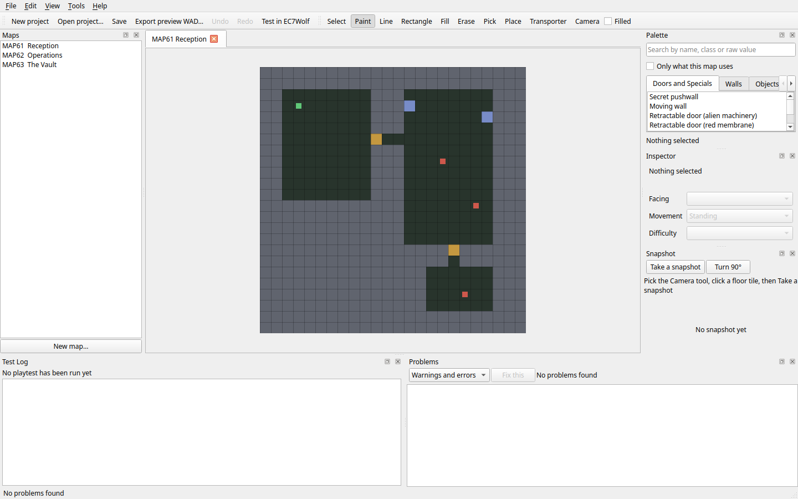
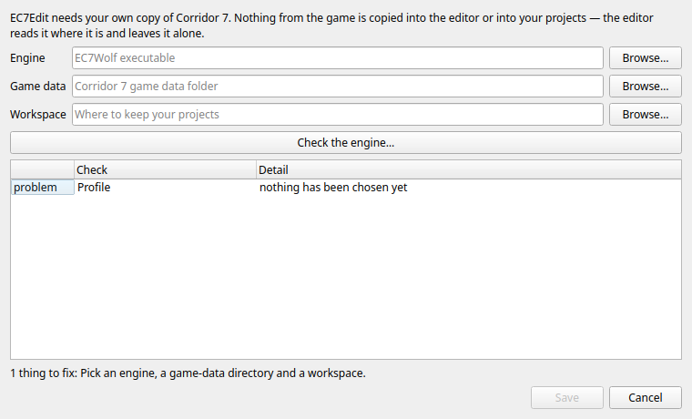
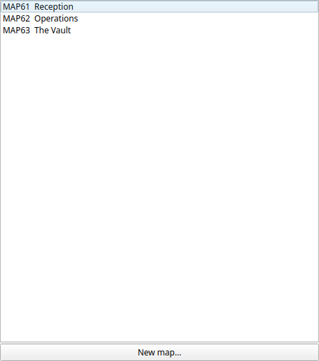
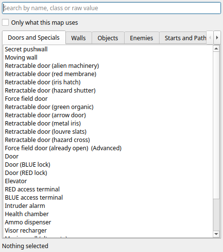
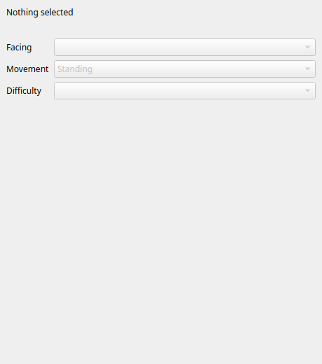
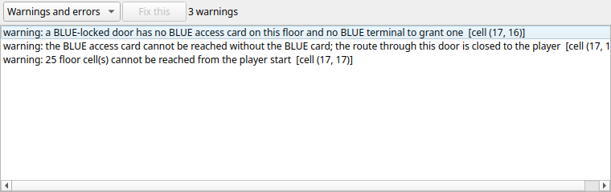
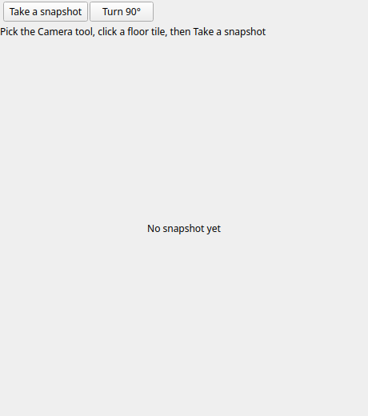
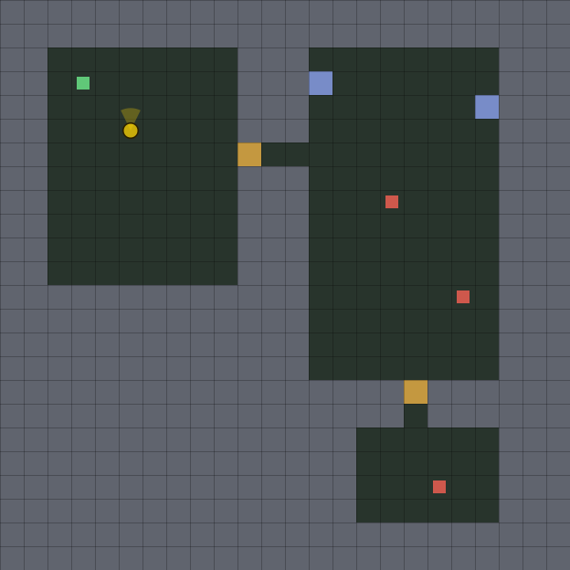
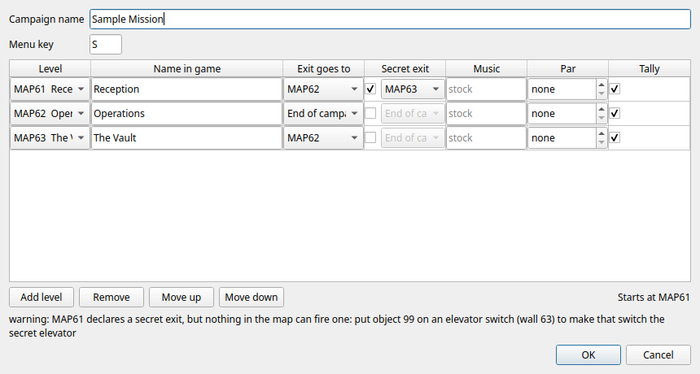

# EC7Edit — the manual

A level editor for *Corridor 7: Alien Invasion*, built alongside EC7Wolf.



This is the whole manual: what the editor is, how to get a map from an empty
grid into the running game, what every panel and tool does, what the warnings
mean, and what to do when something goes wrong. It assumes you have played
Corridor 7 and nothing else. You do not need to know anything about map
formats, and if you ever *do* need to, that is a bug in this document.

> **About the pictures.** Every screenshot here is generated from the real
> editor by `editor/scripts/manual_shots.py`, and regenerated whenever the
> interface changes — a manual illustrated with year-old mock-ups is worse than
> one with no pictures. They are taken with **no game data configured**, which
> is why the map is drawn in flat colors and the palette shows labeled tiles.
> Point the editor at your own copy of Corridor 7 and everything you see here
> is drawn with the game's own artwork instead.

---

## Contents

1. [What you need](#1-what-you-need)
2. [Installing and first run](#2-installing-and-first-run)
3. [A tour of the window](#3-a-tour-of-the-window)
4. [Your first map, start to finish](#4-your-first-map-start-to-finish)
5. [The tools](#5-the-tools)
6. [The palette: what the words mean](#6-the-palette-what-the-words-mean)
7. [Problems, and how to read them](#7-problems-and-how-to-read-them)
8. [Testing in EC7Wolf](#8-testing-in-ec7wolf)
9. [Snapshots](#9-snapshots)
10. [Projects, saving, and getting your work back](#10-projects-saving-and-getting-your-work-back)
11. [Importing a map from the game](#11-importing-a-map-from-the-game)
12. [Sharing what you made](#12-sharing-what-you-made)
13. [Campaigns and map packs](#13-campaigns-and-map-packs)
13a. [Custom monsters, walls and music](#13a-custom-monsters-walls-and-music)
14. [Keyboard reference](#14-keyboard-reference)
15. [The command line](#15-the-command-line)
16. [Where the editor keeps things](#16-where-the-editor-keeps-things)
17. [When something goes wrong](#17-when-something-goes-wrong)
18. [Known limitations](#18-known-limitations)

---

## 1. What you need

Three things, and the editor will ask you for two of them the first time it
starts.

**EC7Edit itself.** Either the packaged download, which contains its own Python
and its own Qt and needs nothing installed, or a source checkout with PySide6.
Both are described in the next section.

**Your own copy of Corridor 7: Alien Invasion.** The editor reads the game's
artwork so it can draw your map the way the game will, and reads its maps if
you want to start from one. **EC7Edit ships no part of Corridor 7** — no maps,
no artwork, no sounds — and cannot invent them. If you do not own the game the
editor still runs, and everything is drawn as labeled placeholder tiles, which
is exactly what the pictures in this manual show.

**EC7Wolf**, to play what you make. The editor launches it for you.

Nothing you make is sent anywhere. The editor has no network code at all.

---

## 2. Installing and first run

### The packaged editor

Unpack the archive and run `ec7edit` (`ec7edit.exe` on Windows) from the folder
you unpacked. That folder holds a complete Python and a complete Qt, so there
is nothing to install first and nothing on your machine to conflict with.

It is a **directory**, not a single file, and that was a measured decision
rather than a habit: a one-file build is the same size once compressed, and
unpacks itself into a temporary folder on *every* launch — about a second, each
time. A directory starts in about a fifth of that. The numbers are in
`editor/docs/e4-evidence-ledger.md`.

You can move the folder anywhere. You can keep several versions side by side.
Removing it is deleting the folder; nothing is installed elsewhere except your
own settings, and section 16 says where those are.

### From a checkout

```sh
cd ECWolf/editor
python3 -m pip install PySide6
./ec7edit
```

The core needs no dependencies at all — everything that reads and writes
Corridor 7's formats is standard library — so `python3 -m ec7edit_core` works
without Qt for the command-line tools in section 15.

### Is it working?

```sh
./ec7edit --selftest
```

builds the real main window without a display and prints what this build is:
version, the Python and Qt inside it, the catalog it found, the schema and
protocol versions it speaks. It is the thing to paste into a bug report.

### First run



The setup page asks for three paths:

| | |
| --- | --- |
| **EC7Wolf executable** | So the editor can launch playtests and take snapshots. |
| **Corridor 7 game data folder** | The folder holding `MAPTEMP.CO7`, `GFXTILES.CO7` and the rest. The editor **only ever reads** from here. |
| **Where to keep your projects** | Anywhere you like; it is only the default folder for dialogs. |

The editor suggests likely places rather than searching your disk — an editor
that walks somebody's home directory looking for a game is not being helpful.

The **Check** button beside the executable actually runs it to confirm what it
is. Nothing is run until you press that button, because running a binary
somebody selected in a file dialog is a real action and should be a deliberate
one.

You can leave the game paths empty and fill them in later from **Tools →
Setup…**; the editor works without them, drawing placeholder tiles.

---

## 3. A tour of the window


Down the middle is the **map**, one tab per open floor. Around it are six
panels, each of which can be dragged somewhere else, floated, or closed — and
**View → Reset layout** puts them all back.

### Maps



Every floor in the project, by slot and name. Double-click to open one. The
**New map…** button and a right-click menu both add one, so an empty project
does not leave you hunting through menus for the way in.

The slot is the `MAPxx` the engine will load. Corridor 7 defines MAP01–MAP60;
section 13 explains why a pack usually wants MAP61 and up.

### Palette



Everything you can place, in seven tabs: **Doors and Specials**, **Walls**,
**Objects**, **Enemies**, **Starts and Paths**, **Zones** and **Raw**. Pick
something here, then paint with it.

The search box takes a name, an actor class, or a raw number — typing `252`
finds the blue-locked door, and typing `blue` finds it too. **Only what this
map uses** narrows the list to the words already on this floor, which is the
fastest way to answer "what *is* that thing in the corner".

The **Raw** tab holds words with no friendly meaning — intermediate animation
frames, values the original maps never use. They are shown rather than hidden
because an imported map may contain them and hiding a cell's real content would
be worse than showing an ugly number.

### Inspector



What is in the cell you clicked: the wall word, the object word, the sound
area, and the artwork for each at twice size. Where a thing has directions or
difficulty variants — an alien facing north, one that appears only on the
harder skills — the drop-downs here change them without you having to know that
those are four consecutive numbers.

### Problems



The editor's opinion of the floor, updated as you work. Section 7 is about
reading it. Some entries offer a **Fix this** button; most deliberately do not,
because most repairs would require guessing what you meant.

### Test Log


What happened the last time you pressed **Test in EC7Wolf** — not the game's
whole output, but the specific questions a playtest needs answered: did *your*
file load, which floor did the engine actually enter, and how did the session
end. Section 8 explains why that is more than it sounds.

### Snapshot



A picture of your map from inside the game, taken by the engine itself.
Section 9.

---

## 4. Your first map, start to finish

Ten minutes, and you will have something you can walk around in.

**1. New project** (`Ctrl+N`), then **New map…** (`Ctrl+M`). Give it a slot —
**MAP61** is a good first choice, because Corridor 7 does not use it, so
nothing you do can disturb the game you already have.

A new map is solid rock. That is not an empty canvas being unhelpful: in this
format a cell is *either* wall or floor, and starting from solid means
everything you carve is deliberate.

**2. Carve a room.** Take the **Rectangle** tool (`R`), tick **Filled** in the
toolbar, choose a **floor** from the palette's Zones tab, and drag out a box.
Floor cells carry a *sound area* — see section 7, because area zero is a real
trap.

**3. Put yourself in it.** Palette → Starts → **Player start**, then the
**Paint** tool (`B`), and click a floor cell. There must be exactly one.

**4. Give it a way out.** Palette → Doors and Specials → **Elevator switch**,
and paint it into a *wall* cell that a floor cell touches. That is the switch
the player uses to finish the floor.

**5. Check it** (`F8`). The Problems panel should say nothing. If it does not,
section 7 explains what it is telling you.

**6. Play it** (`F5`). The editor exports your map, launches EC7Wolf on it, and
fills in the Test Log. You are standing in the room you just made.

**7. Save** (`Ctrl+S`). Projects are `.ec7project` files — one file, plain
JSON, holding every map you have made.

From here: add a second room and a **Door** between them, put an alien in it,
and press `F5` again.

---

## 5. The tools

The toolbar, and the single keys that select them.

| Key | Tool | What it does |
| --- | --- | --- |
| `S` | **Select** | Drag a rectangle. Copy (`Ctrl+C`), paste (`Ctrl+V`), rotate (`Ctrl+Shift+R`), flip. |
| `B` | **Paint** | The plain brush. Click, or drag to draw a stroke. |
| `L` | **Line** | A straight run between two clicks. |
| `R` | **Rectangle** | An outline, or **Filled** if the toolbar box is ticked. |
| `F` | **Fill** | Flood-fill a connected region of identical cells. |
| `E` | **Erase** | Back to solid wall. |
| `I` | **Pick** | Take whatever is under the cursor and make it the current palette selection. Much faster than finding it in a list. |
| `P` | **Place** | Prefabs: a door, a pushwall, a force-field door — several cells that only make sense together, placed as one unit. |
| `T` | **Transporter** | The two ends of a transporter pair, which have to agree with each other. |
| `K` | **Camera** | Place the single snapshot viewpoint, drawn on the map as a ring and a cone. Clicking again moves it. Section 9. |

Every edit is undoable (`Ctrl+Z`), including a whole drag stroke, which counts
as one action rather than forty.

### Prefabs

A door in Corridor 7 is not one word. An animated door is a closed frame plus
three animation frames the engine expects to find; a secret pushwall is a wall
word plus the object marker that makes it move. Getting those wrong produces a
map that loads and misbehaves — the worst kind of bug, because nothing reports
it.

The **Place** tool writes the whole correct group in one action. Everything it
can place is in the palette's *Doors and Specials* tab, including all ten of
the game's animated door styles.

---

## 6. The palette: what the words mean

Underneath, a Corridor 7 map is three grids of 16-bit numbers, 64×64 each:

* **plane 0** — walls, floors and specials. Low numbers are walls, and numbers
  from 256 up are floor cells carrying a *sound area*.
* **plane 1** — objects: your start, aliens, pickups, and markers that modify
  the wall underneath them.
* **plane 2** — unused by Corridor 7. The editor preserves whatever an imported
  map had here and never invents anything.

The palette is a friendly name for each of those numbers, built from the game's
own executable and translator tables rather than typed in by hand — 457 entries
at the time of writing. When a word has no known meaning it appears under
**Raw** with its number, which is honest: the alternative is hiding part of a
map from the person editing it.

Three things worth knowing before you go far:

**A cell can hold two things.** A wall word and an object word can occupy the
same cell, and sometimes must. The secret elevator is exactly this: an ordinary
elevator switch with object **99** on top of it, which is the only thing in the
game that produces a secret exit.

**Directions are numbers.** An alien facing north and the same alien facing
east are consecutive words. The Inspector's **Facing** drop-down is the
civilised way to say it.

**Difficulty is a variant, not a flag.** "Alioprobe — skill 2+" is a different
word from "Alioprobe". The Inspector's **Difficulty** drop-down moves between
them.

---

## 7. Problems, and how to read them


Press `F8`, or just keep working — the panel updates as you edit. Every entry
has a stable code, and the complete list with what each one means is in
[ec7edit-validation.md](ec7edit-validation.md), which is generated from the
validator itself so it cannot drift.

**Errors** are things the engine will refuse or that will certainly go wrong.
**Warnings** are things that are probably a mistake and might not be. The
editor does not stop you shipping a warning; it does stop you exporting an
error.

The three warnings in the picture are one mistake told three ways, which is
what a good validator does: a blue-locked door with no card and no terminal to
grant one, so the card beyond it cannot be reached, so twenty-five floor cells
cannot be reached at all. Fixing the first fixes all three.

Some particular traps worth knowing:

**Sound area zero.** A floor cell's number carries its sound area, and **zero
is not a default — it is no area at all**. Two cells with no area cannot hear
each other, so aliens on such a floor never react to gunfire; they only notice
you when you touch them. No shipped Corridor 7 map has this, so the engine had
never met the case. **Tools → Give the floor sound areas** repairs it, and the
validator warns before you find out the hard way.

**An unsealed boundary.** The engine assumes the outermost ring of a map is
solid. A hole in it lets the player walk out of the world. There is a fix
button for this one.

**Nowhere to finish.** A floor with no elevator switch, floor exit or vortex is
a floor the player cannot leave.

**Reachability.** The editor floods from your start through doors, keys,
transporters and pushwalls and tells you what it could not get to. It is
advisory — it does not simulate combat or the order you find things in — but a
region it cannot reach at all is nearly always a mistake.

---

## 8. Testing in EC7Wolf

**F5**, or **Test in EC7Wolf** on the toolbar. The editor writes your map to a
private file, launches the engine on it, and watches.

The watching is the part that matters. The obvious way to run a playtest is to
start the game and see what happens, and it has a failure that is very hard to
notice: if the engine cannot read the file the editor just wrote, **it says so
and carries on**, playing the shipped map of the same number. You get a
Corridor 7 level, at the slot you asked for, with the name you expected — and
none of your work in it.

So the engine reports on a channel of its own: which file reached the loader
and whether it loaded, which floor was entered *and the name stored in the map
record itself* (the only thing that distinguishes your MAP01 from the game's),
and how the session ended. The Test Log shows those, and says **PASSED** only
when your file loaded and the engine entered your floor.

**Shift+F5** stops a running playtest. Closing the editor stops it too.

The full protocol is documented in
[ec7edit-playtest-protocol.md](ec7edit-playtest-protocol.md).

---

## 9. Snapshots


Pick the **Camera** tool (`K`), click a floor tile, and press **Take a
snapshot** (`F7`). *Turn 90°* re-aims without moving.



There is **one** camera. It is drawn on the map as a ring with a cone showing
which way it faces, clicking again moves it rather than adding a second, and
moving it keeps the angle you chose. The panel names the direction — *facing
90° (north)* — using the engine's convention, where 0° is east and the angle
increases anticlockwise. It is a marker, not a change to the floor:
it writes nothing, it is not an undo step, and it never appears in anything you
export.

It belongs to the floor you placed it on. Open another map and it is not drawn
there, and taking a snapshot of that map asks you to move the camera to it
first, rather than photographing coordinates that mean something else on a
different floor.

What comes back is not the editor's impression of your map. It is a frame
rendered by EC7Wolf, from that tile, at a fixed simulation tic, through the
software renderer — so the same request gives the same picture, and the picture
is the game's own answer to "what does this actually look like".

The panel says which camera the picture is from, and adds *edited since* once
the map has changed underneath it. The picture is kept rather than thrown away:
an out-of-date snapshot is still useful as long as nobody is told it is
current.

**There is no live 3D view, and that is a decision rather than a gap.** An
approximate renderer would have to reimplement how a door's axis is inferred,
how the visor palette animates, how the laser barriers are gated on inventory,
how floor and ceiling shading works — and would then be a *second* authority on
what Corridor 7 looks like, disagreeing with the first. Snapshot answers the
same question with the engine's answer, at the cost of a click instead of a
pan. The reasoning is in [ec7edit-snapshot.md](ec7edit-snapshot.md).

---

## 10. Projects, saving, and getting your work back

A project is a single `.ec7project` file holding every map in it. It is JSON,
so you can read it, diff it, and paste it into a bug report. Plane words are
stored as plain numbers rather than packed into base64 — a few hundred kilobytes
buys the ability to see what changed.

**Save** is `Ctrl+S`. **Save a Copy…** writes a copy somewhere else and keeps
you editing the original, which is the one people expect and rarely get.

The save is more careful than it looks, because every shortcut has a way of
losing work: it writes to a temporary file, checks the result parses back to
what it meant to write, and only then replaces the original. If the file
changed under you since you opened it, you are told rather than overwriting
somebody else's newer save.

**Autosave and recovery.** The editor autosaves in the background. If it
crashes or the machine goes down, the next start offers what it had. Recovery
files live in the location in section 16, never beside your project.

**A project someone sends you is data, not instructions.** Opening one never
touches any path it names — no stat, no open, no network. Unknown fields are
rejected rather than kept and later acted on.

---

## 11. Importing a map from the game

**File → Import map from archive…** (`Ctrl+I`) opens `MAPTEMP.CO7`, lists all
sixty floors, and copies the one you choose into your project.

**Your game files are never written to.** Not by import, not by export, not by
anything: the editor records the digest of what it read and checks it again
afterward, and every write goes through a guard that is told which folders are
off limits.

An imported map keeps its exact original words, including anything the editor
has no name for. It also remembers where it came from, and that has one
consequence worth knowing about now rather than later: **a map imported from
the retail archive cannot go into a map pack** (section 13). Its contents are
Corridor 7's, not yours, and a pack is made to be given away. You can edit it,
play it, and export it privately as much as you like.

---

## 12. Sharing what you made

Three exports, for three different things.

### Preview WAD — `Ctrl+E`

Your maps, and nothing else, in a file EC7Wolf loads with `--file`. It holds
only the map data you made, so it is yours to share. The recipient plays it in
a stock slot, under the stock level's name and music. This is what `F5` uses.

### A full archive — File → Export a full archive… (private)

A complete `MAPTEMP.CO7`: your maps in their slots and all sixty of the game's
copied through unchanged. Useful for playing your work through a normal
campaign. **The result is your own game data and is not shareable** — the
editor says so before it writes anything.

### A map pack — `Ctrl+Shift+E`

Your maps *plus* a generated `MAPINFO` naming them, ordering them, and saying
where each exit goes: a campaign of your own. Section 13.

---

## 13. Campaigns and map packs



**File → Campaign…** lists your maps and asks three things about each: what it
is called in the game, where its exit goes, and whether it has a secret exit.
The first row is where a new game starts; *Move up* changes that.

Everything is checked as you type, and the panel at the bottom is the same list
the command line prints and the tests assert on — there is no second opinion in
the dialog. Errors disable **OK**; warnings do not, because a warning may be
something you mean.

Then **File → Export a map pack…** writes two files: the `.wad`, and a `.txt`
manifest saying what it is, which levels it holds, and that whoever receives it
needs their own copy of Corridor 7. The manifest is written whether you ask for
it or not, because a file that travels needs to say what it is.

Three things about packs that will save you an afternoon:

**Use MAP61 and up.** Corridor 7 defines MAP01–MAP60, and a pack's block for
one of those *replaces* that level rather than adding to it. Above 60 there is
nothing to replace, so a pack cannot disturb the game you already have. Using a
stock slot is allowed and warns.

**One level must end the campaign.** Set its exit to *End of campaign*. Without
that the campaign runs forever, and the editor refuses to build it.

**A secret exit needs the marker.** Corridor 7 has no secret-exit tile. What
produces one is object **99** placed on an elevator switch — that is how the
game's own bonus floors are reached. Declare a secret exit without one and the
editor tells you exactly where to put it. (You can see that warning in the
picture above.)

The engine-side details are in [ec7edit-mappack.md](ec7edit-mappack.md).

---

## 13a. Custom monsters, walls and music

A resource pack is a **`.pk3`** — a zip — holding art the game never had, and
the DECORATE that turns it into actors. The layout is the engine's:

```text
mypack.pk3
├── DECORATE          the actors
├── sprites/          their art, one file per frame
├── textures/         wall textures
├── music/            tracks
└── graphics/         anything else drawn
```

A pack made with
[corridor7-monster-sprite-workflow.md](corridor7-monster-sprite-workflow.md) is
already in exactly this shape and needs no conversion. Anything else in the zip
— previews, notes, working files — is left where it is; the editor does not
ship it.

**File → Resource packs…** attaches one. The dialog shows what is in it and,
once attached, which map word each thing was given. Everything placeable then
appears in the palette's **Custom** tab, grouped by the pack it came from, and
you paint with it exactly like anything else.

### What a map word is, and why it never moves

Corridor 7's own things all have numbers, and its translator says what each one
means. Something from a pack does not, so the editor allocates one — objects
from 900 up, which Corridor 7 never reaches — and generates the translator
entry that gives it meaning.

**That number is written into your map the moment you paint with it.** So the
editor never reuses or renumbers one: a word that changed between sessions
would silently make a map spawn something else, with the map file unchanged and
looking perfectly correct. Attaching a pack twice, or attaching another one
first, leaves every existing word where it was.

A custom *wall* works differently, because plane 0 has no spare high numbers —
256 and up is a floor cell carrying a sound area. A custom texture therefore
re-points a wall ID your maps do not otherwise use, and the generated
translator confines that to your campaign's floors.

### What it does to the base game: nothing

The generated translator `include`s Corridor 7's rather than replacing it, and
is named by each of your maps individually. Load your pack and the rest of the
game is exactly as it was.

### "replaces", and using both

A pack's DECORATE may say `replaces C7Semaj`. That is a **global** switch: every
Semaj in the whole game becomes that actor while the pack is loaded — so the
word the editor allocated and the word the game already had would both spawn
the same thing, and you could not place a real Semaj at all.

**The editor drops it when it builds**, so you can put the custom actor and the
one it was written to replace on the same map and get both. Nothing in your
pack file is changed; only the copy inside the pack the editor exports, and
only that one word — the comments, the states and the art are untouched.

If you *wanted* the global replacement — "make every Semaj in my campaign a
flower" is a reasonable thing to want — untick **Place these alongside the
game's own actors** in *Resource packs…*, and the author's `replaces` is kept.

### Detaching

Detaching a pack does **not** remove things already placed from it. Those words
stay in your maps and stop meaning anything, so the engine spawns nothing where
they are. The editor tells you how many before it does it.

### The pack you export

Once a project has resources, **File → Export a map pack…** writes a `.pk3`
instead of a `.wad` — a WAD has flat eight-character names and no folders, and
the engine works out what a resource is from the folder it is in. One file:

```text
yourpack.pk3
├── maps/MAP61.wad      one per floor
├── MAPINFO             your campaign
├── xlat/ec7edit.txt    the generated placement translator
├── DECORATE            one #include per attached pack
├── decorate/…          each pack's own actors, kept apart
├── sprites/ textures/  their art, copied byte for byte
└── PACKINFO            the manifest
```

Your recipient loads that one file and needs nothing else but their own copy of
Corridor 7.

### Custom music

Put a track in the pack's `music/` folder and name it in **File → Campaign…**
against the level that should play it.

### Custom cinematics

A campaign can end on an animation of its own. Two steps.

**Convert it.** From a video, or from a folder of PNG frames:

```sh
python3 -m ec7edit_core video-encode myending.mp4 --output MYENDING.CO7
python3 -m ec7edit_core video-encode frames/      --output MYENDING.CO7 --fps 14
```

The format is FLIC — 320×200, 8-bit, one palette for the whole animation —
which is what this engine has always played. Given a video file the editor
calls **ffmpeg** to get frames, scaled and letterboxed to fit rather than
stretched. ffmpeg is not required: without it the editor says so and quotes the
one command that produces the frames itself.

Everything after the frames needs nothing installed. Fourteen frames a second
is the game's own rate and a sensible default.

**There is no sound.** FLIC has no audio chunk, and the game's own cinematics
get theirs from sound effects fired at fixed frame numbers. Your video's audio
track is dropped, and the editor says so as it works.

**On size.** A five-second clip of real footage comes to about 900 kB — some
12 kB a frame, against 64 kB for an uncompressed one. Frames are stored as the
difference from the one before, so a talking head costs far less than a
whip-pan, and a still image costs almost nothing.

If you want it smaller, lower `--fps` first: it is a straight trade and 10 fps
still reads as motion. `--colors` below 256 saves less than you would think and
costs more than you would like.

`--stability` decides how much a color has to change before the pixel does.
Real footage is noisy, and reducing each frame on its own turns that noise into
a different palette color every frame across large flat areas — which is paid
for twice, in the file size and in a shimmer across every wall in the picture.
The default of 900 made a real clip a third smaller with nothing visibly
different. Pushing it much past 2000 starts leaving blotches on flat walls.

**Ship it.** Put the result in a resource pack as `video/MYENDING.CO7`, and
name it in your campaign's ending:

```
intermission MyEnding
{
    Flic { Name = "MYENDING" }
    GotoTitle { }
}

map "MAP62" "The Last Floor"
{
    next = EndSequence, "MyEnding"
}
```

The engine looks in loaded packs before the disc's own `video/` folder, so your
cinematic plays without anything being installed beside the game. If it names
an animation nothing carries, the engine says which one rather than showing
nothing — an ending that silently did nothing would look like a crash.


---

## 14. Keyboard reference

### Tools

| | | | | | |
| --- | --- | --- | --- | --- | --- |
| `S` Select | `B` Paint | `L` Line | `R` Rectangle | `F` Fill | `E` Erase |
| `I` Pick | `P` Place | `T` Transporter | `K` Camera | | |

### Everything else

| | |
| --- | --- |
| `Ctrl+N` | New project |
| `Ctrl+O` | Open project |
| `Ctrl+M` | New map |
| `Ctrl+I` | Import map from archive |
| `Ctrl+S` / `Ctrl+Shift+S` | Save / Save As |
| `Ctrl+E` | Export preview WAD |
| `Ctrl+Shift+E` | Export a map pack |
| — | File → Resource packs… |
| `Ctrl+Z` / `Ctrl+Y` | Undo / Redo |
| `Ctrl+C` / `Ctrl+V` | Copy / Paste selection |
| `Ctrl+Shift+R` | Rotate the selection |
| `Ctrl+G` | Show grid |
| `Ctrl++` / `Ctrl+-` | Zoom in / out |
| `F5` / `Shift+F5` | Test in EC7Wolf / stop the test |
| `F7` | Take a snapshot |
| `F8` | Check this map |

---

## 15. The command line

Everything the editor does to files, it can do without a window. The core has
no Qt dependency at all, so this works on a machine with no display.

```sh
python3 -m ec7edit_core inspect  MAPTEMP.CO7          # list the sixty floors
python3 -m ec7edit_core validate MAPTEMP.CO7          # check them
python3 -m ec7edit_core project-new  mine.ec7project
python3 -m ec7edit_core project-import mine.ec7project MAPTEMP.CO7 --map 1
python3 -m ec7edit_core project-export mine.ec7project --output preview.wad
python3 -m ec7edit_core video-encode    clip.mp4 --output MYENDING.CO7
python3 -m ec7edit_core resource-inspect mypack.pk3   # what is in this pack?
python3 -m ec7edit_core resource-add  mine.ec7project mypack.pk3
python3 -m ec7edit_core project-pack   mine.ec7project --output pack.wad
python3 -m ec7edit_core pack-audit     pack.wad        # what is in this file?
```

`project-pack` writes a `.pk3` instead of a `.wad`, and names it so, once the
project has resources attached.

`--protect DIR` may be given to any command that writes, and refuses to write
anywhere inside it. `pack-audit` works on a pack this editor did not build,
which is the point: it answers "what is actually in this file" by opening it.

---

## 16. Where the editor keeps things

| What | Where |
| --- | --- |
| Settings, and your three paths | The platform's usual place for `EC7Wolf` / `EC7Edit` — `~/.config/EC7Wolf/EC7Edit.conf` on Linux, the registry on Windows |
| Autosaves and crash recovery | `~/.local/share/ec7edit/recovery` |
| Your projects | Wherever you saved them. The editor keeps nothing of its own beside them |
| Playtest scratch files | A temporary folder per session, removed when the session ends |
| Snapshots | A private cache, keyed on the engine, the data and the map revision |

Nothing is written next to your Corridor 7 files, ever.

---

## 17. When something goes wrong

**The editor will not start.** Run `./ec7edit --selftest` from a terminal. It
prints what the build is and where it stopped, without needing a display.

**The palette is all gray labeled tiles.** No game data is configured, or the
folder given is not the game's. **Tools → Setup…**, and point it at the folder
holding `MAPTEMP.CO7`.

**The playtest says it passed but I saw a Corridor 7 level.** It should be
impossible — that is the specific thing the Test Log is built to catch, and it
compares the name inside the map record rather than the one MAPINFO shows.
Please report it with the Test Log contents.

**The playtest will not start.** Check the EC7Wolf path in setup. The Test Log
shows the exact command line used, so you can run it yourself.

**Aliens ignore me.** Sound areas — section 7. **Tools → Give the floor sound
areas**.

**My pack will not build.** The campaign dialog's panel lists exactly what is
blocking it, with a code you can look up in
[ec7edit-validation.md](ec7edit-validation.md).

**A map I imported will not go in a pack.** By design; section 11.

---

## 18. Known limitations

Stated plainly, because a manual that hides them wastes your time instead.

* **Maps are 64×64.** That is what Corridor 7 uses and what the engine's own
  loader assumes. Other sizes are not offered.
* **Plane 2 is preserved, not authored.** Corridor 7 does not use it; the
  editor keeps whatever an imported map had and offers no way to author it
  except raw.
* **Reachability is advisory.** It is a flood fill through doors, keys,
  transporters and pushwalls — not a proof that the floor is playable, and not
  a simulation of combat or ammunition.
* **No live 3D view.** Snapshot instead; the reasoning is in section 9.
* **A pack carries maps, metadata and attached resources**, including a
  cinematic. Sound effects are not offered, and cinematics have no audio.
* **Campaign metadata is deliberately bounded**: names, routing, music, par,
  floor number, the tally screen. Colors and skills are not offered — a skill
  block is global and would change the stock game's difficulty levels.
* **The editor is beta**, as is EC7Wolf. The project file format has a schema
  version and a migration path, so projects made now will open later.

---

## See also

* [corridor7-level-editor.md](corridor7-level-editor.md) — the technical plan
  and design compendium behind all of this
* [ec7edit-validation.md](ec7edit-validation.md) — every validation code
* [ec7edit-playtest-protocol.md](ec7edit-playtest-protocol.md) — how the editor
  and the engine talk
* [ec7edit-snapshot.md](ec7edit-snapshot.md) — how snapshots work, and the
  live-preview decision
* [ec7edit-mappack.md](ec7edit-mappack.md) — map packs, and the MAPINFO
  behavior behind them
* [corridor7.md](corridor7.md) — the Corridor 7 port itself

EC7Edit is GPL-3.0-or-later. It contains no part of Corridor 7: Alien Invasion,
which remains the property of its owners.
