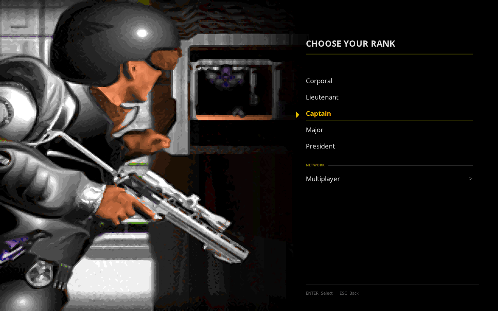
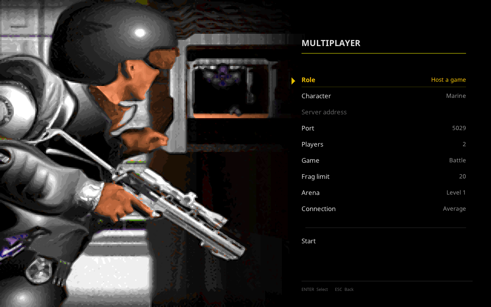
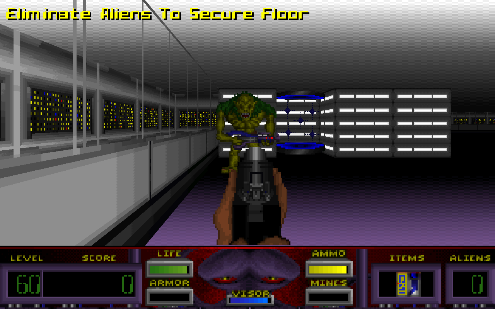
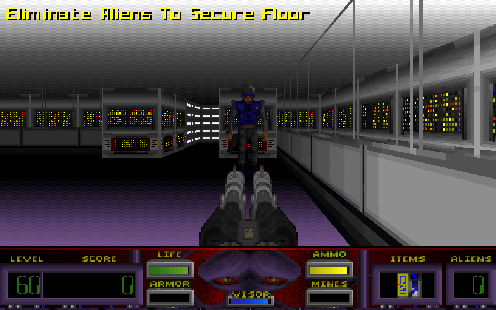

# Multiplayer

Corridor 7's CD release shipped multiplayer, and this port has never exposed
it. ECWolf, which this forks, has a working network implementation that has
never been reachable from the Corridor 7 menu. Both halves exist; nothing joins
them, and one of them cannot survive the internet in its present form.

This is the plan to fix that.

---

## What is already true

Established by reading the code and running it, not assumed:

| | |
| --- | --- |
| **ECWolf has netcode** | `src/wl_net.cpp`, 1031 lines: UDP, host and client, cooperative and battle modes, an arbiter, acked reliable packets, per-player classes |
| **It is reachable only by flag** | `--host <players>`, `--join <address>`, `--port` — no menu path at all |
| **The arenas exist and load** | `MAP51`–`MAP58`, already translated and named "Corridor 7 Network Level 1–8" in `mapinfo/corridor7.txt`. MAP51, 55 and 58 load and render; the HUD reads level 51 and **ALIENS 0**, as a deathmatch map should |
| **The menu has the pieces** | `LabelMenuItem` renders as a section heading — small dim capitals over a hairline — which is exactly the separator this needs, and the Corridor 7 shell already draws it. `TextInputMenuItem` exists for an address field. `MenuSwitcherMenuItem` opens a submenu |
| **There is a determinism harness** | `--capture-checksum` and the `corridor7_determinism` gate. Lockstep multiplayer is only correct while every machine simulates identically, so this is not a nicety — it is the instrument the whole feature is tested with |

## What the original did

From the Technical & Strategy Compendium, §9.5 and §9.1:

* Eight network arenas, internal levels **51–58**. (The CD manual claims ten;
  MapEdit and the warp table say eight, and the namespace agrees with eight.)
* IPX networking and modem play at 9600 baud or better.
* Players choose **Marine or alien classes**, with different health, speed and
  damage.
* **Team mode**: players controlling the same character cannot damage one
  another, and their kills aggregate.
* **Starting positions are assigned randomly** from the placed starts.

## Scope

Internet only. No IPX, no modem, no serial — they solve a 1994 problem, and
nothing that runs this port has the hardware.

Everything else in §9.5 is in scope, because it is what the game was.

---

## The problem that shapes the plan

`Net::PollControls` runs once per tic and calls `ExchangePacket`, which blocks:

```c
while(numAcked != InitVars.numPlayers || numReceived != InitVars.numPlayers)
```

It does not continue until every player's command for **this** tic has arrived
and been acknowledged. That is lockstep, and `TICRATE` is **70**, so it needs a
complete round trip every **14.3 ms**.

On a LAN that is free. Over the internet it is not survivable: at 30 ms
round-trip the game cannot exceed about 33 tics per second, so *everyone* plays
at half speed, and one lost packet stalls every player until it is resent.

So the first work is not the menu. It is making the transport tolerate the
internet, and there is a standard answer that suits this engine well:

**Input delay.** Send each command for a tic some fixed number of tics in the
future, and simulate tic *T* from commands that arrived while tics *T-n*
through *T-1* were being drawn. The round trip then has a whole window to
complete in rather than one tic, and the cost is that your own input takes *n*
tics to appear — 4 tics is 57 ms, 8 tics is 114 ms, which is the trade every
lockstep game of this era made and is imperceptible next to the alternative.

It suits this engine because the simulation is already deterministic and
already has a checksum harness to prove it. The alternative — client/server
with prediction and reconciliation — is a rewrite of the playsim's
relationship to input, and would be a different project.

---

## Milestones

Each milestone ends with something demonstrable and a gate that keeps it
working. No milestone depends on hardware nobody has.

### M0 — Prove the ground — **done**

Two instances on loopback, driven headlessly, playing the same arena.

* A gate that starts a host and a client on `127.0.0.1`, plays a fixed number
  of tics with scripted input, and compares each side's determinism checksum.
* Establishes the harness everything else is judged by: **if the checksums
  diverge, the game has desynced**, and that is the only failure that matters
  in lockstep.

*Exit:* `test_multiplayer_loopback.sh` runs two engines, plays, and both report
the same checksum. Any desync fails the gate with the tic it happened on.

**Done.** The netcode worked on the first honest attempt: 300 tics, both sides
identical every tic. Two things had to be right to get there, and both are now
written into the gate so nobody rediscovers them:

* **Both sides need `--tedlevel`.** It routes through `NewGame`, which calls
  `Net::NewGame`, which exchanges the map and takes the arbiter's. A client
  without it lands in the menu instead, and the host then blocks for ever
  waiting for tic commands from a player who is reading a menu.
* **The two instances need different local ports.** Host and client both bind
  `InitVars.port`, so on one machine they collide, and `--join host:port`
  carries the destination because `--port` is only the local bind.

### M1 — Survive the internet — **done**

Input delay, and the handling that a lossy link demands.

* A configurable delay window, defaulting to something sane and settable in the
  setup menu for people on bad links.
* Commands buffered ahead rather than exchanged synchronously; `ExchangePacket`
  stops being a barrier for the current tic.
* A player who stops responding is timed out and reported, rather than freezing
  everyone for ever.
* Version and data handshake at join: two players with different builds or
  different game data must be told so, not desync fifty tics later.

*Exit:* the loopback gate again, under **simulated latency and loss** — 80 ms
round trip and 2% loss — still in sync and still running at full tic rate.

**Done**, and measured rather than asserted:

| link | tic rate, no delay | with 8 tics of delay |
| --- | --- | --- |
| loopback | 22.4 | 22.1 |
| 80 ms round trip | **8.6** | **21.4** |
| 150 ms round trip | — | 20.8 |

TICRATE is 70; the ceiling of about 22 is what this headless test environment
manages either way, which is the point — **latency stopped costing anything.**
At 80 ms the old path ran at 8.6 tics a second, which is 1/RTT, exactly as a
per-tic round trip predicts.

Simulated with `tools/netdelay.py`, a userspace UDP relay, rather than `tc
netem`: netem needs root and a gate should not.

Three things went wrong on the way, all worth keeping:

* **Stamping commands with `gamestate.TimeCount` does not work.** It is a
  clock, not a counter of exchanges, and does not necessarily advance by one
  between two of them — so a command stamped with it gets stepped over and then
  waited for for ever. The exchange carries a sequence of its own now.
* **The first few tics have no commands at all** and never will, because at the
  first tic the whole window is still ahead. Waiting for them hangs at exactly
  `delay` tics, which is a distinctive enough symptom to recognise again.
* **Resending from the pending ring cannot recover a lost packet.** Entries
  there are cleared as they are consumed, and the command a peer lost is
  precisely one we have already used. Two players then wait for each other for
  ever. There is a separate history of everything sent, which is what gets
  resent.

**Known limitation, for later.** At 5% loss the *handshake* fails — the host
does not get out of `Net::NewGame`, which still uses the original synchronous
exchange. The delayed tic path is fine there; it is the one-off startup
negotiation that is fragile, and it belongs with the rest of the reliability
work in M7.

### M2 — The way in — **done**

The menu, which is what makes the feature exist for a player.

* *New Game* gains a section separator after the difficulty rows and a
  **Multiplayer** entry beneath it — `LabelMenuItem` already draws exactly
  that in the Corridor 7 shell.
* Multiplayer opens its own screen: host or join, **address**, port, arena,
  mode, class.
* Address entry needs `TextInputMenuItem` to work inside the Corridor 7 menu
  shell. The shell draws a right-aligned value for every item, but the editing
  path draws itself, and has never been run there — **this is the one piece of
  M2 that may need real work rather than assembly.**

*Exit:* a gate drives the menu headlessly — down to Multiplayer, into the
screen, type an address, back out — and asserts the entered address reaches
`Net::InitVars`. Screenshots for the README.

**Done**, and the gate asserts something better than the plan asked for. Rather
than checking that the typed text reached `Net::InitVars`, it stands a real
host on the other end and requires the client to *arrive*: 90 tics each, every
one of them agreeing. The address is not the point; connecting is.




The separator needed nothing new: `LabelMenuItem` already draws in this shell
as small dim capitals over a hairline, which is exactly the break the ask
described.

The gate drives the menu with xdotool, and originally counted keystrokes to
each row. That assumes every keystroke arrives. One did not, once, in a full
suite run: the cursor stopped a row short on the rank ladder, Return started a
single-player game instead of opening Multiplayer, and the host sat waiting for
a player who was off playing MAP01 alone -- surfacing twenty minutes later as
what looked like a netcode timeout. It now reads back which row is actually
highlighted (`tools/menu_cursor.py`, which finds the yellow row) and walks
until it is on the one it wants, so a dropped key costs one more keypress
rather than the run. It also cannot overshoot a wrapping list, and stopped
needing to be retuned every time the setup screen grew a row -- which M3
promptly did.

The text field was the part expected to be work, and it was. Two things:

* **The shell renders a row's value through `getValueText()`**, which
  `TextInputMenuItem` never implemented -- the stock menu draws its own field
  inside `draw()`. So the port sat there with no value showing at all.
* **`US_LineInput` draws where the stock menu would be**, in the bitmap font,
  which here is a blue strip across the bottom of the screen while the row
  being edited sits untouched further up. `C7Menu_LineInput` replaces it when
  the shell is active, and it does no layout of its own: it puts the text being
  typed into the item as its value and asks the shell to draw the menu, so the
  value column places it, in the right font, on the right row, exactly as it
  does for everything else.

Two things found by building it that were not menu problems at all:

* **A client must not bind the host's port.** `InitVars.port` is the socket a
  player opens, not the one they talk to -- the destination is in the address
  -- and binding the host's port stops two players sharing a machine or sitting
  behind one router. Clients take an ephemeral port now.
* **Input delay has to be agreed, not chosen.** Both sides were setting their
  own: the host from `--net-delay`, the client from the *Connection* row. Two
  different windows mean the two disagree about which tic a command belongs to,
  their warm-ups differ, and their sequences never line up -- in the gate that
  showed as 6 tics on one side and 13 on the other. It travels in the
  `StartPacket` now, with the game mode and the seed, because it is a property
  of the game rather than a preference.

### M3 — Arenas — **done**

* The eight arenas offered by name in the setup screen.
* **Random starts** from the placed spawn points, per §9.5. Requires finding
  what marks a start in these maps' plane 1 and whether the existing
  translation already carries them.
* Enough spawns for the player count, or an honest refusal.

*Exit:* a gate loads all eight, counts the starts in each, and asserts two
players entering the same arena are placed apart.

**Done**, and the milestone as written contained two wrong assumptions. Both
were about the map data, and both had to be settled by reading it rather than
the documentation.

**The arenas are not where §9.1 says they are.** The compendium's table puts
the network levels at 51-58 and calls 59-60 empty, and it flags a discrepancy
with the manual, which claims ten. Counting the contents of the archive:

| lump | archived name | wall pages | objects |
|---|---|---:|---:|
| MAP51-MAP57 | Network Lvl 1-7 | 8-26 | 4-102 |
| MAP58 | Network Lvl 9 | 2 | 1 |
| MAP59 | Network Lvl 10 | 2 | 1 |
| MAP60 | Network Lvl 8 | 23 | 116 |

MAP58 and MAP59 are bare 64x64 boxes holding a single marker, the same shape
as the unused level at 50. The eighth real arena is at 60, and the archive
calls it "Network Lvl 8". So the compendium has the count right and the range
wrong, and MAPINFO had inherited the wrong range: it named MAP58 "Network Level
8" and MAP60 "Network Level 10". Both corrected, and the arena list the menu
offers is 51-57 and 60.

**There are no placed multiplayer starts to be random about.** §9.5 says
starting positions are "assigned randomly from placed starts", and the
milestone above was written expecting to go looking for whatever marks one in
plane 1. Each arena contains exactly one `Player1Start` and nothing else that
could be a start -- the markers that fill the arenas, 104 and 105, are masked
wall overrides and are not objects at all. Whatever the original did, it was
not choosing among starts a designer placed.

That matters because the arenas also contain no monsters, and ECWolf finds
deathmatch starts for a map that has none by falling back first to monster
positions and then to the co-op starts. Both fallbacks come up empty or
singular here, so every player would have been dealt the same tile and a match
would have begun with everyone standing inside everyone else.

`GameMap::GenerateDeathmatchStarts` deals starts from the arena's floor
instead: open cells with no solid actor on them, shuffled, then taken in order
subject to a five-tile separation so the set covers the arena rather than
clustering wherever the shuffle looked first. If an arena is too tight to hold
32 starts that far apart the separation is relaxed rather than the set returned
short.

The shuffle is driven by the game seed the host sends in the `StartPacket`,
mixed with the map name, and deliberately does not draw from the global RNG
streams -- those are shared with the simulation, and drawing from them during
map load would make the number of floor tiles in a map a term in every later
random number in the match. Everyone therefore deals the same hand, which is
what the gate checks: the two player traces have to come out identical, not
merely plausible.

Found on the way, in code this milestone was the first to exercise:

* `GetPlayerSpawn` read `players[p].mo->x` after testing `!players[p].mo &&
  players[p].health <= 0`. Before the first spawn of a round every pawn is null
  while health is already set, so the `&&` let that through to dereference it.
  It had never fired because no shipped map had deathmatch starts to select
  among.
* The setup rows were labelled with `setText`, and a multiple-choice item keeps
  its current value in its text -- so the first time a row was changed it
  renamed itself to its own value, and Role read "Host a game    Host a game".
  `AddLabeled` already existed for exactly this and says so in its comment.


### M4 — The rules — **done**

* Battle mode: ECWolf's `GM_Battle` already implies friendly fire, item
  respawn and no monsters.
* **Team mode** as the original had it: players on the same character cannot
  damage one another and their kills aggregate.
* Frags, and a match end condition.

*Exit:* a gate scripts two players into a fight and asserts the frag counters,
the friendly-fire rule in both modes, and that a match ends when it should.

**Done.** More of this was already present than the milestone assumed: frags
are counted, a kill scores and a suicide costs one, players respawn in a
netgame, and `GM_Battle` already meant no monsters and respawning items. What
was missing was everything to do with sides.

`Net::FriendlyFire()` was a global on/off -- it could answer "is
player-versus-player switched on", which is the wrong shape of question for a
mode whose entire rule is that the answer depends on *which two players*. It is
now `Net::CanDamage(attacker, target)`, used by all four places that asked:
the damage itself, and the three target-selection loops that must also not
*aim* at a team-mate.

Everything else that tested `gameMode == GM_Battle` was really asking "is this
a deathmatch" and would have answered wrongly the moment a second deathmatch
mode existed, so those became `Net::Deathmatch()`.

Teams are dealt by player number for now. 9.5 describes a team and a character
as the same thing, and the characters arrive in M5, at which point
`PlayerTeam` becomes a lookup of the chosen one. Dealing them by number needs
nothing on the wire, since every machine already agrees what number each player
is -- but it does mean two players are never on the same side, which is why the
gate needs three.

The frag limit travels in the `StartPacket` with the seed and the game mode.
Reaching it ends the match on every machine at once without a packet about it:
frags only change when damage is applied, damage is applied in the same tic
everywhere, so every machine reaches the same conclusion on its own. Announcing
it instead would put the decision on one machine and make the others wait.

The arenas' `next` was `MAP01`, so winning a deathmatch dropped everybody into
the first floor of the campaign. Each now names itself, and is marked
`nointermission` -- a floor tally between rounds of a deathmatch is the wrong
screen, and the scoreboard is M6's business.

Scripting a fight headlessly needed two new capture tools, and the constraint
that shaped both is that a world override in a netgame must be applied
*identically everywhere*. `--capture-warp` cannot be used: it pins
`players[ConsolePlayer]`, which is a different pawn on each machine.

* `--capture-duel A B [C]` stands two players face to face, with an optional
  third at A's shoulder, on floor it finds in the map itself -- so every
  machine computes the same positions without a byte being sent. The third
  exists because team kills adding up cannot be demonstrated by one scorer.
* `--capture-fire [N]` holds the trigger, injected into the local command
  *before* it is sent, so the shot travels the way a real one does rather than
  being applied behind the network's back.
* `--capture-ammo` keeps everyone's magazines full, because a scripted fight
  otherwise ends at about two kills.

Two things this turned up:

* **A pinned angle holds a player dead for ever.** A corpse turns towards the
  angle it died facing, and only once it has arrived does the player become
  eligible to respawn. The duel pinned the angle every tic, the death rotation
  pushed it two degrees, the pin put it back, and the two never agreed -- so
  after the first kill the fight simply stopped. It reads exactly like a weapon
  or a network fault, and cost a long detour before it turned out to be the
  test fixture standing on the death animation's foot. Dead players are left
  where they fall now.
* **The gates run a fresh binary against a stale `ec7wolf.pk3`.** They take the
  executable from the build directory and everything else from the data
  directory, so a MAPINFO or DECORATE change is invisible to them until the pk3
  is copied across. Here that meant the arenas kept their old `next = MAP01`
  and their tally screen, and the match hung on a screen waiting for a keypress
  nobody was there to press.

### M5 — Marine and alien — **done**

The original let you *be* the alien, and that is the most distinctive thing in
this whole feature.

* An alien player class with its own health, speed and damage, from §9.5 and
  from whatever the executable yields.
* Class chosen in the setup screen; `Net::NewGame` already carries a class name
  per player, so the plumbing is there.
* The alien needs a view model, a HUD that makes sense for it, and its own
  sounds.

*Exit:* a gate starts a two-player match with one of each class and asserts
each has the right pawn, health and speed. Screenshots of both.

**Done.** The plumbing was indeed already there -- `NewGamePacket` carries a
class index per player and `Net::NewGame` keeps them all, so nothing new
crosses the wire. What took the work was deciding what the alien *is*, and
discovering what the Marine was.

**The Marine had no body.** `C7Player`'s states named C744 and C745, which are
two frames of the exit vortex. Nobody had ever seen it, because a player is the
one actor you are never looking at -- until multiplayer, where every player is
something the others have to draw. The archive turned out to hold a complete
human soldier nobody had wired up: five walk frames in eight rotations, a pain
frame, a seven-frame death and a three-frame firing pose, at C459-C509, with a
*second* one in grey immediately after it. Two skins is what a game with more
than one player on screen needs, which is a decent argument that this is what
they were for. `co7map.txt` names the first of them MARN.

**The alien is Eitak**, and that is an argument rather than a citation, so here
it is. §9.5 says only "the Marine or alien classes". Eitak is the game's
primary alien-world guard -- the alien counterpart to a human soldier rather
than a sentry, a floating probe or a boss -- it is upright and carries a
weapon, and it is one of only seven actors in the entire archive drawn in eight
rotations. A player is seen from every angle by definition, so whatever the
original used had to be one of those seven, and of the seven it is the obvious
one.




**The numbers are a reconstruction and are meant to read as one.** §9.5 names
three axes and gives a figure for none of them. What *is* documented is the
split of the arsenal: the guide's weapon table gives 1-4 to the human, notes
that the M-24 "starts with Marine", and gives 5-8 to the alien, drawing on two
separate ammunition pools. So the classes differ in damage by carrying
different halves of a documented armoury rather than by a multiplier. Health
follows the bestiary, where every alien warrior outlasts the Marine's hundred.
The speed difference is the invented part, and pays for the extra health.

| | Marine | Eitak warrior |
|---|---|---|
| health | 100 | 150 |
| stride | full | four fifths |
| starts with | M-24 C.A.W., standard ammunition | Dual Blaster, alien energy |

**A team is now the character**, which is what §9.5 said it was all along:
`PlayerTeam` looks up the player's class instead of dealing sides by player
number. The M4 gate had to be told who is playing what, since it can no longer
rely on two players being on opposite sides for free.

Two things worth recording:

* **Declaring a second player class silently added a menu.** ECWolf inserts a
  "Choose Player" step whenever MAPINFO lists more than one class, so New
  Mission started asking single-player players whether they would like to be an
  alien. The campaign is the Marine's -- the manual sends a special-forces
  Marine down to restore contact, and no briefing, line of dialogue or ending
  accommodates anybody else -- so the C7 menu skips it and the choice stays
  where §9.5 puts it, in the multiplayer setup screen.
* **The menu gate's pixel threshold broke again.** M3 replaced counted
  keystrokes with "walk until the highlighted row is past y=N", which survived
  M4 growing the screen by one row and failed when M5 grew it by another: the
  threshold then matched the row *above* the one wanted. It walks until the
  selection wraps to the top and steps back up one now. Both targets are the
  last row of their menu, and being last is a fact about the menu rather than
  about its current height.

### M6 — Presentation

* A scoreboard, and frags on the HUD where Corridor 7 has room for them.
* End-of-match tally in the original's visual language.
* The join screen saying something useful while it waits, rather than
  appearing to hang.

*Exit:* screenshot gates for the scoreboard and the tally; the join screen
shows progress under a deliberately slow connection.

### M7 — Hardening

* Malformed and hostile packets rejected rather than trusted — this is a socket
  open to the internet, and the current code reads structures straight off it.
* NAT and firewall reality: what port to forward, and what to tell someone
  whose connection never completes.
* Documentation, the README section, and the full gate set.

*Exit:* a gate that fires malformed, truncated and oversized packets at a host
and requires it to survive them; the whole suite green.

Standing against this milestone, found earlier and not yet fixed:

* **The handshake is the fragile part, not the tic path.** `Net::NewGame` and
  `Net::Init` exchange with a synchronous `ExchangePacket` that has no delay
  window to hide a round trip in, so a lost packet there costs the whole
  connection rather than a tic. At 5% loss it regularly fails to complete. Once
  a match is running the delayed path rides out the same link.
* The latency gate stalls occasionally at 2% loss -- twice in a day's runs,
  taking about 180 seconds and finishing a few tics short, against 32 seconds
  and a clean pass otherwise. Same cause as above, and worth a retry rather
  than a mystery when it happens.

  It used to report that stall as *"the two sides diverged"*, because it
  compared the two checksum logs whole and a truncated run is missing its tail.
  That is the most alarming thing this gate can say and it was saying it about
  a link problem. It now judges agreement on the tics both sides actually
  simulated and reports falling short separately, so a real desync still fails
  the gate and a stall no longer impersonates one.

---

## What is not in this plan

* **IPX, modem, serial.** Out of scope by intent.
* **Matchmaking, a server browser, a master server.** You type an address, as
  asked. Everything here would support a browser later; none of it needs one.
* **More than the engine's `MAXPLAYERS` of 11.** No reason to raise it.

## Risks, honestly

| Risk | Why it matters | What reduces it |
| --- | --- | --- |
| Lockstep over the internet | The entire feature is unplayable without M1 | M1 is first, and its gate is latency and loss, not loopback |
| Desync | Silent, and fatal; two players simply diverge | The determinism harness already exists and every milestone's gate uses it |
| Text entry in the Corridor 7 shell | The one part of M2 that is not assembly | Fall back to the engine's own menu style for that one field if it proves stubborn |
| Alien class fidelity | §9.5 gives characteristics, not numbers | Treat as an evidence-based reconstruction and say so, as the port does elsewhere |
| Nobody to test with | Two machines and a person at each | Every gate is two local instances; a real session between two houses is the acceptance test, not the development loop |
