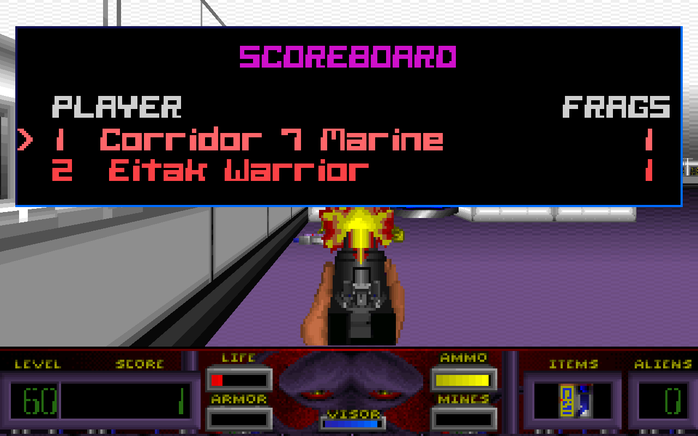
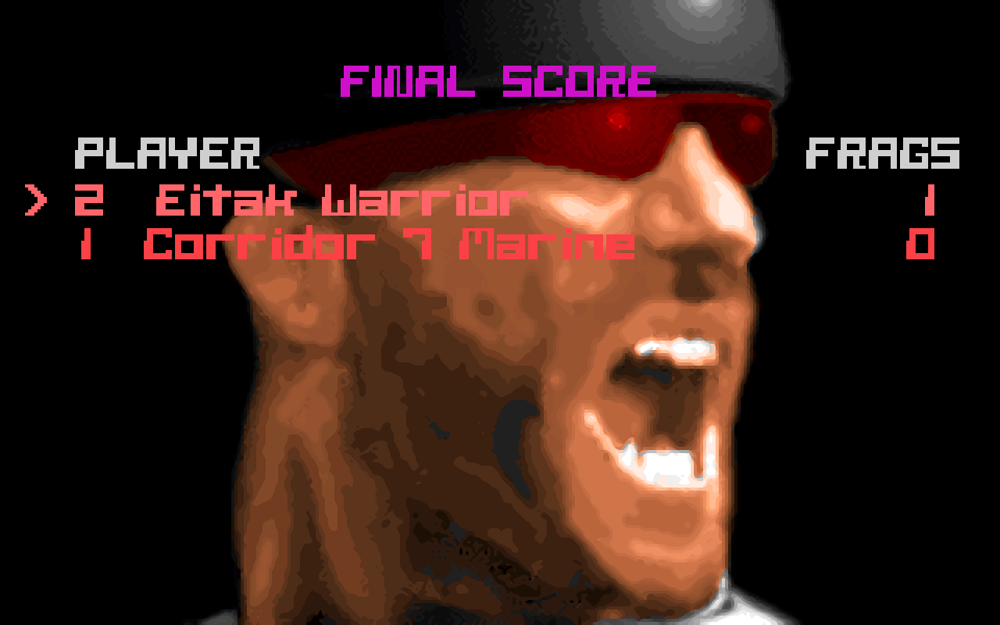
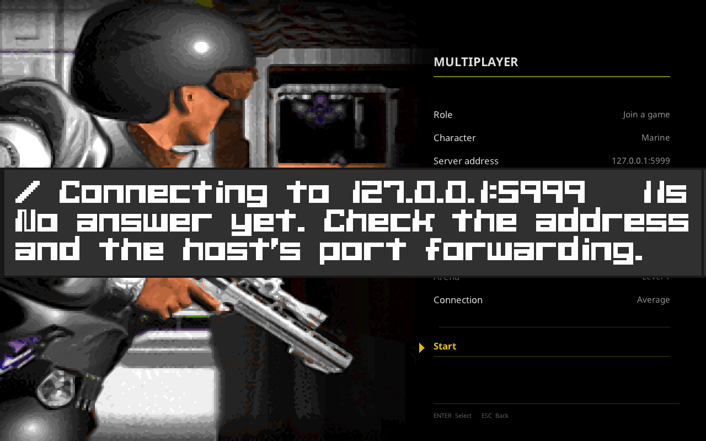

# Multiplayer

Corridor 7's CD release shipped multiplayer, and this port did not expose it.
ECWolf, which this forks, has a working network implementation that was never
reachable from the Corridor 7 menu. Both halves existed; nothing joined them,
and one of them could not survive the internet in its present form.

**All eight milestones below are done.** You can host or join from the menu,
over the internet, on any of the eight arenas, as the Marine or as the alien,
free-for-all or in teams, with a scoreboard and a frag limit.

What follows is the plan as it was written, with each milestone's outcome
recorded underneath it -- including the several places where the plan turned
out to be wrong about the game, and the places where a fix made things worse
and was dropped. Those are the useful part. A milestone that went exactly as
written teaches nobody anything.

Two things it does **not** do, stated here rather than at the end:

* It does not talk to a DOS copy. None of the original's IPX or modem protocol
  is reproduced; the transport is ECWolf's, over UDP.
* The exchange that starts a level is still fragile on a lossy link -- about
  half of connections complete at 5% packet loss -- and a player who leaves
  mid-match freezes the others rather than being dropped. Both are written up
  under M7, with measurements.

---

## What is already true

Established by reading the code and running it, not assumed:

| | |
| --- | --- |
| **ECWolf has netcode** | `src/wl_net.cpp`, 1031 lines: UDP, host and client, cooperative and battle modes, an arbiter, acked reliable packets, per-player classes |
| **It is reachable only by flag** | `--host <players>`, `--join <address>`, `--port` — no menu path at all |
| **The arenas exist and load** | `MAP51`–`MAP58`, already translated and named "Corridor 7 Network Level 1–8" in `mapinfo/corridor7.txt`. MAP51, 55 and 58 load and render; the HUD reads level 51 and **ALIENS 0**, as a deathmatch map should |
| **The menu has the pieces** | `LabelMenuItem` renders as a section heading — small dim capitals over a hairline — which is exactly the separator this needs, and the Corridor 7 shell already draws it. `TextInputMenuItem` exists for an address field. `MenuSwitcherMenuItem` opens a submenu |
| **There is a determinism harness** | `--capture-checksum` and the `corridor7_determinism` gate. Lockstep multiplayer is only correct while every machine simulates identically, so this is not a nicety — it is the instrument the whole feature is tested with |

## What the original did

From the Technical & Strategy Compendium, §9.5 and §9.1:

* Eight network arenas, internal levels **51–58**. (The CD manual claims ten;
  MapEdit and the warp table say eight, and the namespace agrees with eight.)
* IPX networking and modem play at 9600 baud or better.
* Players choose **Marine or alien classes**, with different health, speed and
  damage.
* **Team mode**: players controlling the same character cannot damage one
  another, and their kills aggregate.
* **Starting positions are assigned randomly** from the placed starts.

## Scope

Internet only. No IPX, no modem, no serial — they solve a 1994 problem, and
nothing that runs this port has the hardware.

Everything else in §9.5 is in scope, because it is what the game was.

---

## The problem that shapes the plan

`Net::PollControls` runs once per tic and calls `ExchangePacket`, which blocks:

```c
while(numAcked != InitVars.numPlayers || numReceived != InitVars.numPlayers)
```

It does not continue until every player's command for **this** tic has arrived
and been acknowledged. That is lockstep, and `TICRATE` is **70**, so it needs a
complete round trip every **14.3 ms**.

On a LAN that is free. Over the internet it is not survivable: at 30 ms
round-trip the game cannot exceed about 33 tics per second, so *everyone* plays
at half speed, and one lost packet stalls every player until it is resent.

So the first work is not the menu. It is making the transport tolerate the
internet, and there is a standard answer that suits this engine well:

**Input delay.** Send each command for a tic some fixed number of tics in the
future, and simulate tic *T* from commands that arrived while tics *T-n*
through *T-1* were being drawn. The round trip then has a whole window to
complete in rather than one tic, and the cost is that your own input takes *n*
tics to appear — 4 tics is 57 ms, 8 tics is 114 ms, which is the trade every
lockstep game of this era made and is imperceptible next to the alternative.

It suits this engine because the simulation is already deterministic and
already has a checksum harness to prove it. The alternative — client/server
with prediction and reconciliation — is a rewrite of the playsim's
relationship to input, and would be a different project.

---

## Milestones

Each milestone ends with something demonstrable and a gate that keeps it
working. No milestone depends on hardware nobody has.

### M0 — Prove the ground — **done**

Two instances on loopback, driven headlessly, playing the same arena.

* A gate that starts a host and a client on `127.0.0.1`, plays a fixed number
  of tics with scripted input, and compares each side's determinism checksum.
* Establishes the harness everything else is judged by: **if the checksums
  diverge, the game has desynced**, and that is the only failure that matters
  in lockstep.

*Exit:* `test_multiplayer_loopback.sh` runs two engines, plays, and both report
the same checksum. Any desync fails the gate with the tic it happened on.

**Done.** The netcode worked on the first honest attempt: 300 tics, both sides
identical every tic. Two things had to be right to get there, and both are now
written into the gate so nobody rediscovers them:

* **Both sides need `--tedlevel`.** It routes through `NewGame`, which calls
  `Net::NewGame`, which exchanges the map and takes the arbiter's. A client
  without it lands in the menu instead, and the host then blocks for ever
  waiting for tic commands from a player who is reading a menu.
* **The two instances need different local ports.** Host and client both bind
  `InitVars.port`, so on one machine they collide, and `--join host:port`
  carries the destination because `--port` is only the local bind.

### M1 — Survive the internet — **done**

Input delay, and the handling that a lossy link demands.

* A configurable delay window, defaulting to something sane and settable in the
  setup menu for people on bad links.
* Commands buffered ahead rather than exchanged synchronously; `ExchangePacket`
  stops being a barrier for the current tic.
* A player who stops responding is timed out and reported, rather than freezing
  everyone for ever.
* Version and data handshake at join: two players with different builds or
  different game data must be told so, not desync fifty tics later.

*Exit:* the loopback gate again, under **simulated latency and loss** — 80 ms
round trip and 2% loss — still in sync and still running at full tic rate.

**Done**, and measured rather than asserted:

| link | tic rate, no delay | with 8 tics of delay |
| --- | --- | --- |
| loopback | 22.4 | 22.1 |
| 80 ms round trip | **8.6** | **21.4** |
| 150 ms round trip | — | 20.8 |

TICRATE is 70; the ceiling of about 22 is what this headless test environment
manages either way, which is the point — **latency stopped costing anything.**
At 80 ms the old path ran at 8.6 tics a second, which is 1/RTT, exactly as a
per-tic round trip predicts.

Simulated with `tools/netdelay.py`, a userspace UDP relay, rather than `tc
netem`: netem needs root and a gate should not.

Three things went wrong on the way, all worth keeping:

* **Stamping commands with `gamestate.TimeCount` does not work.** It is a
  clock, not a counter of exchanges, and does not necessarily advance by one
  between two of them — so a command stamped with it gets stepped over and then
  waited for for ever. The exchange carries a sequence of its own now.
* **The first few tics have no commands at all** and never will, because at the
  first tic the whole window is still ahead. Waiting for them hangs at exactly
  `delay` tics, which is a distinctive enough symptom to recognise again.
* **Resending from the pending ring cannot recover a lost packet.** Entries
  there are cleared as they are consumed, and the command a peer lost is
  precisely one we have already used. Two players then wait for each other for
  ever. There is a separate history of everything sent, which is what gets
  resent.

**Known limitation, for later.** At 5% loss the *handshake* fails — the host
does not get out of `Net::NewGame`, which still uses the original synchronous
exchange. The delayed tic path is fine there; it is the one-off startup
negotiation that is fragile, and it belongs with the rest of the reliability
work in M7.

### M2 — The way in — **done**

The menu, which is what makes the feature exist for a player.

* *New Game* gains a section separator after the difficulty rows and a
  **Multiplayer** entry beneath it — `LabelMenuItem` already draws exactly
  that in the Corridor 7 shell.
* Multiplayer opens its own screen: host or join, **address**, port, arena,
  mode, class.
* Address entry needs `TextInputMenuItem` to work inside the Corridor 7 menu
  shell. The shell draws a right-aligned value for every item, but the editing
  path draws itself, and has never been run there — **this is the one piece of
  M2 that may need real work rather than assembly.**

*Exit:* a gate drives the menu headlessly — down to Multiplayer, into the
screen, type an address, back out — and asserts the entered address reaches
`Net::InitVars`. Screenshots for the README.

**Done**, and the gate asserts something better than the plan asked for. Rather
than checking that the typed text reached `Net::InitVars`, it stands a real
host on the other end and requires the client to *arrive*: 90 tics each, every
one of them agreeing. The address is not the point; connecting is.


The separator needed nothing new: `LabelMenuItem` already draws in this shell
as small dim capitals over a hairline, which is exactly the break the ask
described.

The gate drives the menu with xdotool, and originally counted keystrokes to
each row. That assumes every keystroke arrives. One did not, once, in a full
suite run: the cursor stopped a row short on the rank ladder, Return started a
single-player game instead of opening Multiplayer, and the host sat waiting for
a player who was off playing MAP01 alone -- surfacing twenty minutes later as
what looked like a netcode timeout. It now reads back which row is actually
highlighted (`tools/menu_cursor.py`, which finds the yellow row) and walks
until it is on the one it wants, so a dropped key costs one more keypress
rather than the run. It also cannot overshoot a wrapping list, and stopped
needing to be retuned every time the setup screen grew a row -- which M3
promptly did.

The text field was the part expected to be work, and it was. Two things:

* **The shell renders a row's value through `getValueText()`**, which
  `TextInputMenuItem` never implemented -- the stock menu draws its own field
  inside `draw()`. So the port sat there with no value showing at all.
* **`US_LineInput` draws where the stock menu would be**, in the bitmap font,
  which here is a blue strip across the bottom of the screen while the row
  being edited sits untouched further up. `C7Menu_LineInput` replaces it when
  the shell is active, and it does no layout of its own: it puts the text being
  typed into the item as its value and asks the shell to draw the menu, so the
  value column places it, in the right font, on the right row, exactly as it
  does for everything else.

Two things found by building it that were not menu problems at all:

* **A client must not bind the host's port.** `InitVars.port` is the socket a
  player opens, not the one they talk to -- the destination is in the address
  -- and binding the host's port stops two players sharing a machine or sitting
  behind one router. Clients take an ephemeral port now.
* **Input delay has to be agreed, not chosen.** Both sides were setting their
  own: the host from `--net-delay`, the client from the *Connection* row. Two
  different windows mean the two disagree about which tic a command belongs to,
  their warm-ups differ, and their sequences never line up -- in the gate that
  showed as 6 tics on one side and 13 on the other. It travels in the
  `StartPacket` now, with the game mode and the seed, because it is a property
  of the game rather than a preference.

### M3 — Arenas — **done**

* The eight arenas offered by name in the setup screen.
* **Random starts** from the placed spawn points, per §9.5. Requires finding
  what marks a start in these maps' plane 1 and whether the existing
  translation already carries them.
* Enough spawns for the player count, or an honest refusal.

*Exit:* a gate loads all eight, counts the starts in each, and asserts two
players entering the same arena are placed apart.

**Done**, and the milestone as written contained two wrong assumptions. Both
were about the map data, and both had to be settled by reading it rather than
the documentation.

**The arenas are not where §9.1 says they are.** The compendium's table puts
the network levels at 51-58 and calls 59-60 empty, and it flags a discrepancy
with the manual, which claims ten. Counting the contents of the archive:

| lump | archived name | wall pages | objects |
|---|---|---:|---:|
| MAP51-MAP57 | Network Lvl 1-7 | 8-26 | 4-102 |
| MAP58 | Network Lvl 9 | 2 | 1 |
| MAP59 | Network Lvl 10 | 2 | 1 |
| MAP60 | Network Lvl 8 | 23 | 116 |

MAP58 and MAP59 are bare 64x64 boxes holding a single marker, the same shape
as the unused level at 50. The eighth real arena is at 60, and the archive
calls it "Network Lvl 8". So the compendium has the count right and the range
wrong, and MAPINFO had inherited the wrong range: it named MAP58 "Network Level
8" and MAP60 "Network Level 10". Both corrected, and the arena list the menu
offers is 51-57 and 60.

**There are no placed multiplayer starts to be random about.** §9.5 says
starting positions are "assigned randomly from placed starts", and the
milestone above was written expecting to go looking for whatever marks one in
plane 1. Each arena contains exactly one `Player1Start` and nothing else that
could be a start -- the markers that fill the arenas, 104 and 105, are masked
wall overrides and are not objects at all. Whatever the original did, it was
not choosing among starts a designer placed.

That matters because the arenas also contain no monsters, and ECWolf finds
deathmatch starts for a map that has none by falling back first to monster
positions and then to the co-op starts. Both fallbacks come up empty or
singular here, so every player would have been dealt the same tile and a match
would have begun with everyone standing inside everyone else.

`GameMap::GenerateDeathmatchStarts` deals starts from the arena's floor
instead: open cells with no solid actor on them, shuffled, then taken in order
subject to a five-tile separation so the set covers the arena rather than
clustering wherever the shuffle looked first. If an arena is too tight to hold
32 starts that far apart the separation is relaxed rather than the set returned
short.

The shuffle is driven by the game seed the host sends in the `StartPacket`,
mixed with the map name, and deliberately does not draw from the global RNG
streams -- those are shared with the simulation, and drawing from them during
map load would make the number of floor tiles in a map a term in every later
random number in the match. Everyone therefore deals the same hand, which is
what the gate checks: the two player traces have to come out identical, not
merely plausible.

Found on the way, in code this milestone was the first to exercise:

* `GetPlayerSpawn` read `players[p].mo->x` after testing `!players[p].mo &&
  players[p].health <= 0`. Before the first spawn of a round every pawn is null
  while health is already set, so the `&&` let that through to dereference it.
  It had never fired because no shipped map had deathmatch starts to select
  among.
* The setup rows were labelled with `setText`, and a multiple-choice item keeps
  its current value in its text -- so the first time a row was changed it
  renamed itself to its own value, and Role read "Host a game    Host a game".
  `AddLabeled` already existed for exactly this and says so in its comment.


### M4 — The rules — **done**

* Battle mode: ECWolf's `GM_Battle` already implies friendly fire, item
  respawn and no monsters.
* **Team mode** as the original had it: players on the same character cannot
  damage one another and their kills aggregate.
* Frags, and a match end condition.

*Exit:* a gate scripts two players into a fight and asserts the frag counters,
the friendly-fire rule in both modes, and that a match ends when it should.

**Done.** More of this was already present than the milestone assumed: frags
are counted, a kill scores and a suicide costs one, players respawn in a
netgame, and `GM_Battle` already meant no monsters and respawning items. What
was missing was everything to do with sides.

`Net::FriendlyFire()` was a global on/off -- it could answer "is
player-versus-player switched on", which is the wrong shape of question for a
mode whose entire rule is that the answer depends on *which two players*. It is
now `Net::CanDamage(attacker, target)`, used by all four places that asked:
the damage itself, and the three target-selection loops that must also not
*aim* at a team-mate.

Everything else that tested `gameMode == GM_Battle` was really asking "is this
a deathmatch" and would have answered wrongly the moment a second deathmatch
mode existed, so those became `Net::Deathmatch()`.

Teams are dealt by player number for now. 9.5 describes a team and a character
as the same thing, and the characters arrive in M5, at which point
`PlayerTeam` becomes a lookup of the chosen one. Dealing them by number needs
nothing on the wire, since every machine already agrees what number each player
is -- but it does mean two players are never on the same side, which is why the
gate needs three.

The frag limit travels in the `StartPacket` with the seed and the game mode.
Reaching it ends the match on every machine at once without a packet about it:
frags only change when damage is applied, damage is applied in the same tic
everywhere, so every machine reaches the same conclusion on its own. Announcing
it instead would put the decision on one machine and make the others wait.

The arenas' `next` was `MAP01`, so winning a deathmatch dropped everybody into
the first floor of the campaign. Each now names itself, and is marked
`nointermission` -- a floor tally between rounds of a deathmatch is the wrong
screen, and the scoreboard is M6's business.

Scripting a fight headlessly needed two new capture tools, and the constraint
that shaped both is that a world override in a netgame must be applied
*identically everywhere*. `--capture-warp` cannot be used: it pins
`players[ConsolePlayer]`, which is a different pawn on each machine.

* `--capture-duel A B [C]` stands two players face to face, with an optional
  third at A's shoulder, on floor it finds in the map itself -- so every
  machine computes the same positions without a byte being sent. The third
  exists because team kills adding up cannot be demonstrated by one scorer.
* `--capture-fire [N]` holds the trigger, injected into the local command
  *before* it is sent, so the shot travels the way a real one does rather than
  being applied behind the network's back.
* `--capture-ammo` keeps everyone's magazines full, because a scripted fight
  otherwise ends at about two kills.

Two things this turned up:

* **A pinned angle holds a player dead for ever.** A corpse turns towards the
  angle it died facing, and only once it has arrived does the player become
  eligible to respawn. The duel pinned the angle every tic, the death rotation
  pushed it two degrees, the pin put it back, and the two never agreed -- so
  after the first kill the fight simply stopped. It reads exactly like a weapon
  or a network fault, and cost a long detour before it turned out to be the
  test fixture standing on the death animation's foot. Dead players are left
  where they fall now.
* **The gates run a fresh binary against a stale `ec7wolf.pk3`.** They take the
  executable from the build directory and everything else from the data
  directory, so a MAPINFO or DECORATE change is invisible to them until the pk3
  is copied across. Here that meant the arenas kept their old `next = MAP01`
  and their tally screen, and the match hung on a screen waiting for a keypress
  nobody was there to press.

### M5 — Marine and alien — **done**

The original let you *be* the alien, and that is the most distinctive thing in
this whole feature.

* An alien player class with its own health, speed and damage, from §9.5 and
  from whatever the executable yields.
* Class chosen in the setup screen; `Net::NewGame` already carries a class name
  per player, so the plumbing is there.
* The alien needs a view model, a HUD that makes sense for it, and its own
  sounds.

*Exit:* a gate starts a two-player match with one of each class and asserts
each has the right pawn, health and speed. Screenshots of both.

**Done.** The plumbing was indeed already there -- `NewGamePacket` carries a
class index per player and `Net::NewGame` keeps them all, so nothing new
crosses the wire. What took the work was deciding what the alien *is*, and
discovering what the Marine was.

**The Marine had no body.** `C7Player`'s states named C744 and C745, which are
two frames of the exit vortex. Nobody had ever seen it, because a player is the
one actor you are never looking at -- until multiplayer, where every player is
something the others have to draw. The archive turned out to hold a complete
human soldier nobody had wired up: five walk frames in eight rotations, a pain
frame, a seven-frame death and a three-frame firing pose, at C459-C509, with a
*second* one in grey immediately after it. Two skins is what a game with more
than one player on screen needs, which is a decent argument that this is what
they were for. `co7map.txt` names the first of them MARN.

**The alien is Eitak**, and that is an argument rather than a citation, so here
it is. §9.5 says only "the Marine or alien classes". Eitak is the game's
primary alien-world guard -- the alien counterpart to a human soldier rather
than a sentry, a floating probe or a boss -- it is upright and carries a
weapon, and it is one of only seven actors in the entire archive drawn in eight
rotations. A player is seen from every angle by definition, so whatever the
original used had to be one of those seven, and of the seven it is the obvious
one.


**The numbers are a reconstruction and are meant to read as one.** §9.5 names
three axes and gives a figure for none of them. What *is* documented is the
split of the arsenal: the guide's weapon table gives 1-4 to the human, notes
that the M-24 "starts with Marine", and gives 5-8 to the alien, drawing on two
separate ammunition pools. So the classes differ in damage by carrying
different halves of a documented armoury rather than by a multiplier. Health
follows the bestiary, where every alien warrior outlasts the Marine's hundred.
The speed difference is the invented part, and pays for the extra health.

| | Marine | Eitak warrior |
|---|---|---|
| health | 100 | 150 |
| stride | full | four fifths |
| starts with | M-24 C.A.W., standard ammunition | Dual Blaster, alien energy |

**A team is now the character**, which is what §9.5 said it was all along:
`PlayerTeam` looks up the player's class instead of dealing sides by player
number. The M4 gate had to be told who is playing what, since it can no longer
rely on two players being on opposite sides for free.

Two things worth recording:

* **Declaring a second player class silently added a menu.** ECWolf inserts a
  "Choose Player" step whenever MAPINFO lists more than one class, so New
  Mission started asking single-player players whether they would like to be an
  alien. The campaign is the Marine's -- the manual sends a special-forces
  Marine down to restore contact, and no briefing, line of dialogue or ending
  accommodates anybody else -- so the C7 menu skips it and the choice stays
  where §9.5 puts it, in the multiplayer setup screen.
* **The menu gate's pixel threshold broke again.** M3 replaced counted
  keystrokes with "walk until the highlighted row is past y=N", which survived
  M4 growing the screen by one row and failed when M5 grew it by another: the
  threshold then matched the row *above* the one wanted. It walks until the
  selection wraps to the top and steps back up one now. Both targets are the
  last row of their menu, and being last is a fact about the menu rather than
  about its current height.

### M6 — Presentation — **done**

* A scoreboard, and frags on the HUD where Corridor 7 has room for them.
* End-of-match tally in the original's visual language.
* The join screen saying something useful while it waits, rather than
  appearing to hang.

*Exit:* screenshot gates for the scoreboard and the tally; the join screen
shows progress under a deliberately slow connection.

**Done.** The visual language was not invented: Corridor 7 already has a page
that lists people in order with a number beside each, and the scoreboard and
the tally are drawn as members of that family -- the high-score page's font,
printed through the same stencil, on its backdrop, with the same descending row
colours, at its own coordinates. `C7StencilPrintAt` is shared rather than
copied, so the two cannot drift apart.




The scoreboard is held rather than toggled, on the backtick -- Tab is
Corridor 7's floor map, so the key the genre would use is already spoken for.
Rows are sorted by frags and by player number where those tie, because a sort
that broke ties by anything else would give two players a different table for
the same game. Your own row is marked, since with two of the same character on
the board there is otherwise no telling which line is yours.

**Frags were not on the HUD after all.** M4 recorded that the SCORE box shows
frags in a deathmatch, and `DrawScore` does make that substitution -- but the
Corridor 7 status bar never calls it. It draws its own boxes, and its box had
gone on reporting a score that nothing in an arena can change. It reads frags
now.

**The end-of-match tally waits, but not for ever.** Ten seconds, or until
somebody presses something; `ACK_Any`, so one player can move it along rather
than everyone having to. A tally that blocks until a key arrives is a tally
that can hang an entire match on one player who has gone to make tea.

**Two join screens, and the worse one was the one nobody looks at.** The
menu's shows a spinner, the address it is trying, the seconds elapsed and,
after ten of them, what to check. The command line had no screen at all: for
Corridor 7, `DrawStartupConsole` draws the signon splash and returns before
printing anything -- a deliberate decision, since ECWolf's initialisation
chatter has no business over the game's own opening art, and exactly wrong for
the one screen where the game is waiting on somebody else. The network phase
has its own callback now.



That is the second version of this screen. The first used `Message()`, the
bitmap window the engine has always used for "press Y to quit", and it was the
wrong instrument in three separate ways: set in the 320x200 bitmap font while
every other screen the player had just been looking at was not; sized to its
text and then clipping whatever exceeded 310 virtual pixels, so the line
explaining what to check ran off the edge; and repainted only when something
called it, which made the spinner move in whatever steps the socket poll
happened to take -- about two and a half distinct frames a second.

The replacement is drawn by the menu shell: same backdrop, same heading over
the same hairline, same label and value columns, same typeface. The other
players appear as rows, which is the grammar the setup screen already uses. The
bar sweeps on wall-clock time rather than on how often it is called, the note
wraps to the column instead of being cut off at it, and the wait loops poll at
about 60Hz instead of ten times a second -- measured at 40 redraws a second on
software rendering.

Worth noting where the fault really was: the network code was building the
*sentence*. It formatted a spinner, padded the text to stop the box resizing,
and handed the result to whoever was drawing -- which meant the one place with
no idea what it was being drawn on was deciding how it looked. `Net::InitStatus`
carries facts now, and the menu and the command line each present them their
own way.


Four things this turned up:

* **An overlay added to `R_DrawPlayViewOverlays` is never drawn.** That
  function is the GL backend's coverage pass; the actual painting goes through
  `Renderer->DrawViewOverlay` once per overlay. An overlay registered only in
  the first is told about and never painted, which looks exactly like a drawing
  bug in the overlay itself.
* **`Message()` cuts off what will not fit.** It clamps its box to 310 virtual
  pixels, so the advice on the join screen ran off the right-hand edge --
  explaining nothing, at length.
* **A page cannot be photographed by waiting for its log line.** stdout to a
  file is block-buffered, so "reached the frag limit" lands long after the
  tally has been and gone. `--capture-tally` lets the page say when it is up,
  which is the only thing that knows.
* Two instances must not both stop at the same capture frame: whichever quits
  first leaves the other waiting on a player who has gone.

### M7 — Hardening — **done**

* Malformed and hostile packets rejected rather than trusted — this is a socket
  open to the internet, and the current code reads structures straight off it.
* NAT and firewall reality: what port to forward, and what to tell someone
  whose connection never completes.
* Documentation, the README section, and the full gate set.

*Exit:* a gate that fires malformed, truncated and oversized packets at a host
and requires it to survive them; the whole suite green.

**Done**, with one item deliberately left standing and written up below rather
than papered over.

#### What was actually reachable from a forged packet

`CheckPacketType` proves a datagram is at least `sizeof(T)` and carries the
right type byte. That is enough for every fixed-size packet and not enough for
the start packet, which ends in a client array whose length is declared by a
byte *inside* the packet -- so the size of the struct was never the size that
mattered. From one forged datagram, before this milestone:

* `numPlayers` up to 255, walking `Client[MAXPLAYERS]` off the end of itself
  and **writing** as it went.
* `playerNumber` up to 255, becoming an index into `players[]`.
* a `gameMode` outside its enum, and a tic delay large enough to swamp the
  extratics ring.
* `ArgS[256]` in a debug command with no terminator anywhere in it, handed
  straight to `FString`, which reads off the end of the datagram looking for
  one.

A client sitting on a join screen is the most exposed the game ever is: an open
socket, waiting, willing to believe the first thing that answers. It now
believes only the host it dialled, and only after the contents have been
checked against the length actually received.

Two things that are *not* defects and are worth saying so:

* **A host waiting for players will accept a connection request from anyone.**
  That is what hosting means, and a bare `0x00` byte is a well-formed request.
  The gate leaves those out when shooting at a waiting host, because proving
  that somebody can join proves nothing.
* **Movement fields are unbounded on the wire but bounded by their reader** --
  `wl_agent.cpp` clamps `controly` to ±100 before using it, so a peer sending
  nonsense moves absurdly rather than dangerously.

#### The exchange that starts a level, which is still fragile

`Net::NewGame` exchanges the map and difficulty with a synchronous
`ExchangePacket`: every player sends, every player waits for everyone else's
packet *and* for everyone else to acknowledge its own. There is no delay window
to hide a round trip in, and no recovery once a peer has left the exchange.

**Measured at 5% loss and an 80 ms round trip: six connections in twelve
complete.** The rest hang before the level loads. Once a match is running the
delayed tic path rides out the same link without trouble; this is the minute
before that.

A stuck exchange used to say nothing whatever -- the game simply stopped. It
now reports, every three seconds, which player it is waiting on and which half
it is waiting for, because those fail for different reasons: *no packet* means
theirs is not arriving, *no ack* means ours is not.

**An attempted fix made it markedly worse, and is recorded here so that nobody
tries it again without measuring.** A player leaves the exchange as soon as it
has everyone's packet and everyone has acked its own -- which says nothing
about whether its own ack arrived. If that ack is lost, the player it was owed
to waits for ever, resending a packet the sender no longer recognises:
`HandleCommandPackets` knows `StartPacket` and re-acks it, and did not know
`NewGamePacket`. Teaching it to re-ack that too is the obvious symmetry, it is
what the start packet already does, and measured over twelve connections each
way it took the success rate from **6 in 12 down to 1 in 12**. The reason is
not yet understood. It is not in the tree.

Fixing this properly means reworking the exchange so that leaving it is
negotiated rather than assumed, which is a larger change than hardening and
wants its own measurements. Until then: a connection that does not complete
should be retried, and the diagnostic says which end to look at.

#### Pressing Start on a screen nobody has typed in

Found by a person on a Linux box rather than by any of this, which is the wrong
way round for a milestone called hardening.

The setup screen opens with Role on "Join a game" and the address empty --
exactly the state a player is in the first time they open it. Pressing Start
there killed the process outright, and so did setting Role to "Host a game" and
pressing Start, which is what somebody hosting for the first time does and has
no address to type.

Two faults, one on top of the other:

* `StartMultiplayer` read and trimmed the address *before* it consulted the
  role, so hosting went through the address handling too, despite a host never
  having one.
* `FString::StripLeftRight` walks off the end of an empty string. `j` is a
  `size_t`, so `j = max - 1` on a length of zero is `SIZE_MAX`, the `j >= i`
  that follows is true, and the copy loop then writes its way up the address
  space until glibc stops it. Both overloads had it. Nothing in the engine had
  ever called it on a string that might be empty, so it sat there unnoticed.

The second is the real one and is fixed in `FString` rather than at the call
site, since it was a trap laid for every future caller. The gate is
`multiplayer_setup`: one instance, no network, two keypresses -- press Start on
an untouched screen, then press it again as a host -- and it must survive both,
end up actually listening, and abort nowhere. Verified to fail without the
`FString` guard.

Worth noting what let this through: every gate up to here typed an address in,
because every gate was written to exercise the thing working. None of them
tried the screen the way somebody sees it first.

#### And a player who leaves takes everyone with them

The same shape of problem, one layer up. The delayed tic exchange assembles a
tic from every player's commands and will wait for ever for one that is never
coming -- so a player who quits, crashes or walks out of wireless range leaves
everybody else frozen, in silence.

It now says so, every three seconds, naming the player it is waiting on. It
does not act on it, and that is deliberate: dropping a player is a decision
every remaining machine would have to reach in the *same tic* or they diverge
from each other, which is a worse failure than waiting. Doing it properly means
a vote, or an arbiter with the authority to declare somebody gone, and that is
a design rather than a patch.

The same stall is what makes the latency gate intermittent -- at 2% loss it
hits perhaps one run in three, because both instances stop at a fixed tic count
and whichever finishes first stops answering the other. That gate now retries
the delayed run once and says when it did. What it is there to prove is that
input delay keeps a match in sync and makes it several times faster, and a link
that stalled answers neither question; a real regression still fails both
attempts.

### M8 — Getting back out — **done**

Reported from play, and all one report: *once you are on the host screen you
cannot leave it.* Escape did nothing on the desktop; the back button did
nothing on a phone; and on a phone the address field could not be typed into
either, so the only way out of a game nobody joined was to kill the process.

**Nothing was reading the keyboard.** The connect loops live in the network
code and called back into the menu only to *draw*. The return value of that
callback was discarded at all eight call sites, and the drawing function never
polled input -- so there was no path by which a keypress could have been
noticed. Pressing Escape harder was never going to work. `InitStatusCallback`
now means "keep waiting", the loops honour it, `Net::Init` returns whether a
game was actually started, and the menu goes back to the setup screen with what
the player typed still in it.

Two things this turned up on the way:

* `DrawNetworkStatus`, the command-line path's callback, **returned false**.
  That was harmless while the answer was thrown away and would have abandoned
  every `--host` and `--join` before the first packet the moment it was not.
* The socket is closed on the way out. A player who gives up usually tries
  again immediately, and a port still held by the abandoned attempt would meet
  "address already in use" on the second go.

**The keyboard never came up on Android** because nothing ever asked SDL for
text. Desktop SDL leaves text input on permanently, so `SDL_StartTextInput`
was never needed and never written; on Android it is what raises the on-screen
keyboard. Both text fields ask for it now and stop when they are done, so the
keyboard does not sit over the menu afterwards.

That fix exposed a second fault underneath it. `LastASCII` is a single slot
that every `SDL_TEXTINPUT` overwrites, and `IN_ProcessEvents` drains the whole
event queue before the field reads it -- so a burst of characters arrives as
one. A person typing on a physical keyboard never hit it; an on-screen keyboard
does, and `10.1.0.55` arrived as `1.055`. Typed characters are queued now.

**And there was no back button at all** in the Android menu overlay -- four
arrows and Enter, nothing else -- so leaving any menu screen meant swiping up
the system navigation bar first. There is one now, above Enter, drawn rather
than lettered: the `esc.png` in the asset set is a picture of a keyboard key,
which is the same thing the F1 map button was replaced for.

*Exit:* `tools/test_multiplayer_cancel.sh` drives the menu the way a player
does and fails against the un-fixed build. It covers the waiting screen only.
The typing faults are verified on a device, because the desktop cannot
reproduce them: `xdotool` with no delay still spreads its key events over
several frames, so a check written for it passed against deliberately broken
code -- and a check that cannot fail is worse than none.
### Finding a netgame that stops

A netgame that freezes used to say almost nothing. The waits announce
themselves -- `Waiting 3s for tic 225 from player 2` -- but that names only
the machine that went quiet, never what the quiet one is doing, and it goes to
stdout, which a game launched from a desktop icon does not have.

Chasing one of these by hand cost an afternoon and did not find it. What the
evidence did establish, from a frozen tablet, was worth writing down:

* the process was at **96.8% CPU** -- spinning, not blocked;
* its UDP socket had **230,400 bytes unread and 120,249 drops** -- it was
  being sent to and was not reading.

That last one narrows things more than it looks. Every network wait in this
engine -- `ExchangePacket`, `ExchangeDelayedTicCmds`, `SendReliablePacket`,
`CheckAck` -- drains the socket on every pass. A receive queue that fills means
the stuck machine is in **none** of them: it left the game loop and is spinning
somewhere that does no networking at all, which is most of the engine.

So `--netwatchdog` exists. Loops that can run long name themselves through
`NetWatch()`, and a thread reports the current one every two seconds for as
long as the playsim is not advancing:

```
NETWATCH: playsim has not advanced for 52s -- in 'net: exchanging a tic', which is spinning (tic=0)
NETWATCH: playsim has not advanced for 52s -- in 'in a menu', which is spinning (tic=0)
```

Those two lines are one deadlock, read from both ends: a host waiting for a tic
from a player who joined and then sat in the menus, which is a real fault and
was found by turning this on. `spinning` and `stuck` are distinguished because
they want different answers -- a loop that will not exit is not a loop that has
stopped being run.

It is off unless asked for, costs a string assignment and an increment per
iteration when on, and goes through `Printf`, so on Android it lands in logcat
and the argument goes in the launcher's Args box like any other.
### A held button counted as a new press, once per tic

Reported as the visor: one tap of Enter, or of the visor button on a phone,
and the palette lurched through night vision and infrared and back -- as if
the key were being hit over and over. It was.

`buttonheld` is "the same button, last tic", and every edge-triggered verb in
the game reads it: the visor, the floor map, the automap, pause. wl_play's
`PollControls` maintains it the obvious way, by copying buttonstate before
rebuilding it from input -- but with input delay, `Net::PollControls` has by
then overwritten the local player's buttonstate with a command from ticDelay
tics ago. So the value being copied was not what the player had pressed last
tic; it was what they had pressed eleven tics ago, which for the whole width
of the delay window is "nothing". Every tic of a genuine hold looked like a
fresh press.

Single player never saw it, because there is no delay window there.

The edge is now measured against the raw input actually sent last tic, which
the network path already has to hand. Measured with `--capture-verbs`: a 400ms
hold of the visor key, about twenty-eight tics, advances the visor exactly
once.

### A player who vanishes ends the match, instead of stopping it

Every wait here was infinite. Lose a peer -- host closes the window, phone
drops off wifi, process killed -- and the survivors sat drawing their last
frame with no message and no way out, which is what "both games froze" turned
out to mean more than once.

A peer silent for fifteen seconds is now written off:

```
NETWATCH: playsim has not advanced for 14s -- in 'net: assembling a delayed tic', which is spinning
Player 1 left the game. Ending the match.
```

and the player is told so on screen before being returned to the menu, on a
timer rather than a keypress, because the machine most likely to be reading it
is a phone with no keyboard.

Dropping one player and playing on is the thing that cannot be done safely:
every machine would have to drop them in the same tic or the simulations
diverge. Ending the match needs no such agreement -- everyone still present is
waiting on the same missing player and reaches the same conclusion within a
second or so -- so that is what happens. The goodbye packet is sent three times
and not waited on, because a reliable send there would be one more thing to
hang on.

Fifteen seconds is long enough to survive a hitch, a level load on a slow
phone, or a moment of bad wifi, and short enough that nobody sits in front of a
frozen screen wondering whether waiting will help.

---

## What is not in this plan

* **IPX, modem, serial.** Out of scope by intent.
* **Matchmaking, a server browser, a master server.** You type an address, as
  asked. Everything here would support a browser later; none of it needs one.
* **More than the engine's `MAXPLAYERS` of 11.** No reason to raise it.

## Risks, honestly

Written before any of it was built. Kept as written, with what actually
happened in the last column.

| Risk | Why it matters | What reduces it | How it turned out |
| --- | --- | --- | --- |
| Lockstep over the internet | The entire feature is unplayable without M1 | M1 is first, and its gate is latency and loss, not loopback | Solved. 8 tics/sec to 21 on an 80 ms link |
| Desync | Silent, and fatal; two players simply diverge | The determinism harness already exists and every milestone's gate uses it | Never happened once in the tic path. Every gate compares tic for tic |
| Text entry in the Corridor 7 shell | The one part of M2 that is not assembly | Fall back to the engine's own menu style for that one field if it proves stubborn | Needed the fallback's opposite: the shell draws the field, the engine's own version drew it in the wrong place entirely |
| Alien class fidelity | §9.5 gives characteristics, not numbers | Treat as an evidence-based reconstruction and say so, as the port does elsewhere | Done that way. The weapon split turned out to be documented; health and speed are not |
| Nobody to test with | Two machines and a person at each | Every gate is two local instances; a real session between two houses is the acceptance test, not the development loop | Still true. Everything here was proven on loopback and a simulated link; nobody has yet played it between two houses |

The risk that was not on this list is the one that cost the most: **the plan
was wrong about the game more often than the code was wrong about the plan.**
The arenas are not where the documentation says. The Marine had no body. There
were no placed multiplayer starts to be random about. Frags were not on the HUD
after M4 said they were. Each of those was found by building the thing and
looking at it, not by reading.

<details>
<summary>The original risk table, before the last column was added</summary>

| Risk | Why it matters | What reduces it |
| --- | --- | --- |
| Lockstep over the internet | The entire feature is unplayable without M1 | M1 is first, and its gate is latency and loss, not loopback |
| Desync | Silent, and fatal; two players simply diverge | The determinism harness already exists and every milestone's gate uses it |
| Text entry in the Corridor 7 shell | The one part of M2 that is not assembly | Fall back to the engine's own menu style for that one field if it proves stubborn |
| Alien class fidelity | §9.5 gives characteristics, not numbers | Treat as an evidence-based reconstruction and say so, as the port does elsewhere |
| Nobody to test with | Two machines and a person at each | Every gate is two local instances; a real session between two houses is the acceptance test, not the development loop |

</details>
